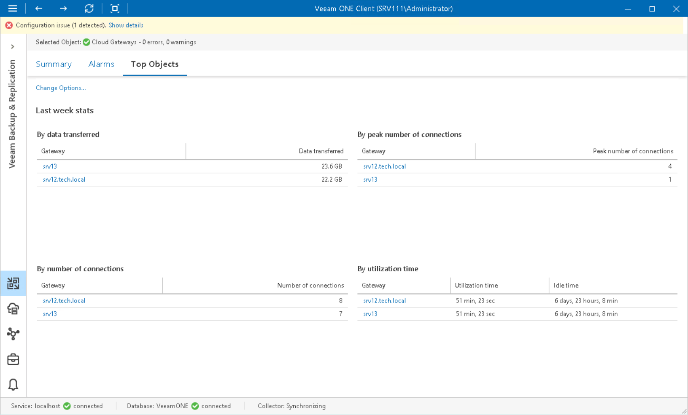

# Top Cloud Gateways

The Top Objects dashboard provides performance data of the most utilized cloud gateways for the selected server or gateway pool over the last week. The dashboard shows the most 'busy' cloud gateways for the last 7 days in terms of:

* Amount of data transferred to cloud repositories
* Number unique users connected to each cloud gateway
* Maximum number of user connections to the gateway
* Total amount of time the gateway was utilized

To view the list of the most loaded cloud gateways:

1. Open Veeam ONE Client.

For details, see [Accessing Veeam ONE Components](access.md).

1. At the bottom of the inventory pane, click Veeam Backup & Replication.
2. In the inventory pane, expand select the necessary node:

* To view the most utilized standalone gateways, select the Cloud Gateways node under the necessary backup server.

* To view the most utilized gateways from a gateway pool, select the necessary gateway pool under the Cloud Gateways node.

1. Open the Top Objects tab.

