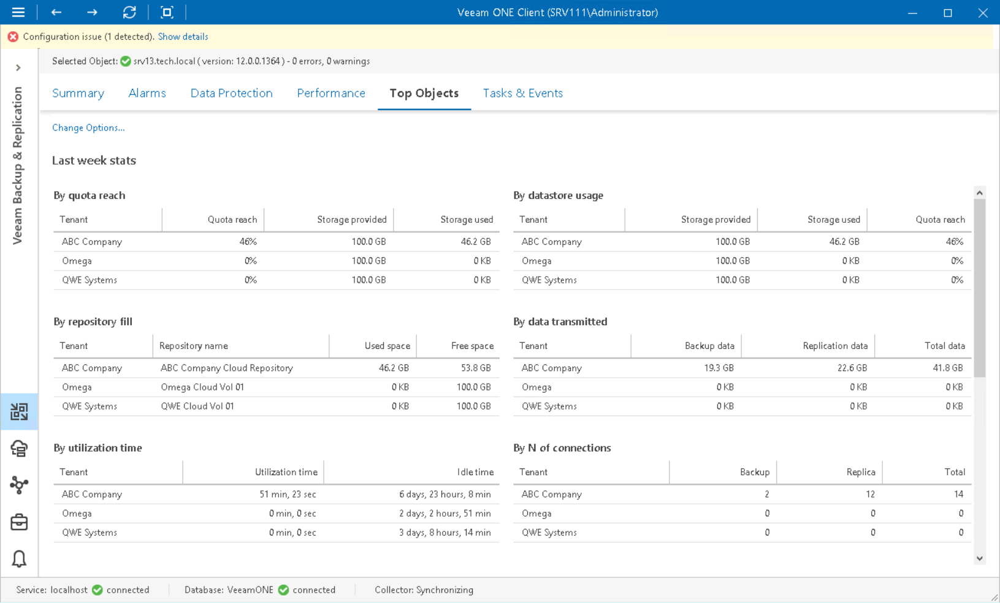

# Top Cloud Tenants

The Top Objects dashboard helps you detect top Veeam Cloud Connect users.

The dashboard displays top users in terms of transmitted data, used cloud storage space, number of connections, amount of gateway utilization time, traffic savings, peak transmission rate, number of failovers, number of replicated VMs and so on. By default, the dashboard displays top 3 user accounts ranged by consumed cloud repository space. You can change the number of displayed used accounts in the dashboard settings:

1. Open Veeam ONE Client.

For details, see [Accessing Veeam ONE Components](access.md).

1. At the bottom of the inventory pane, click Veeam Backup & Replication.
2. In the inventory pane, select the necessary backup server.
3. Open the Top Objects tab.
4. Click the Change Options link in the top left corner of the dashboard and select the necessary number of tenants to display.
5. Click OK.

