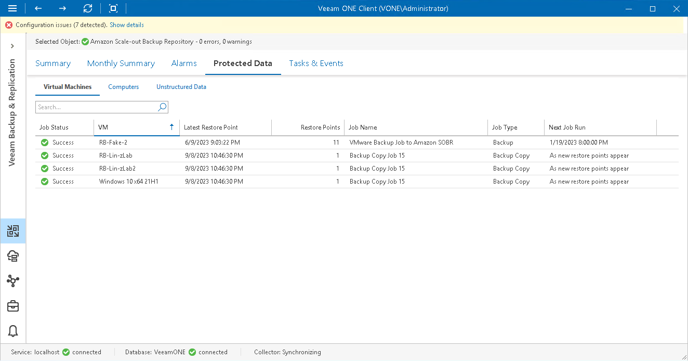

# Virtual Machines

To view the list of VMs stored in backups on repositories:

1. Open Veeam ONE Client.

For details, see [Accessing Veeam ONE Components](access.md).

1. At the bottom of the inventory pane, click Veeam Backup & Replication.
2. In the inventory pane, select the necessary repository.
3. Open the Protected Data tab and navigate to Virtual Machines.
4. To quickly find VMs by name, use the Search field at the top of the list.

For every VM in the list, the following details are shown:

* Job Status — the latest status of the job that created the VM backup (Success, Warning, Failed or Running).
* VM — name of the VM stored in a backup on the repository.
* Latest Restore Point — date and time when the latest restore point was created for the VM.
* Restore Points — number of restore points created for the VM.
* Job Name — name of a backup or backup copy job that created VM backup.
* Job Type — type of the job that created the VM backup (Backup job or Copy job).
* Next Job Run — schedule according to which the job will start next time.

You can click column names to sort VMs by a specific parameter. For example, to view what VMs do not have recent backups, you can sort VMs in the list by Latest Restore Point.

