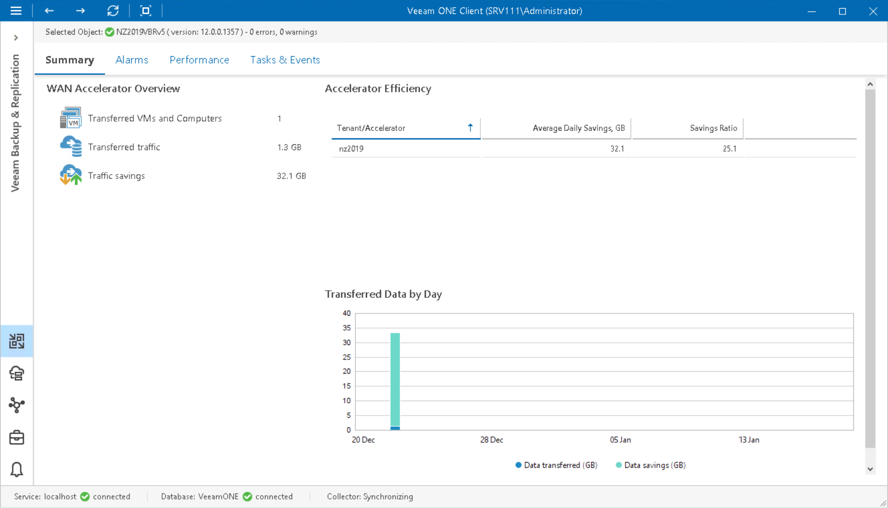

# WAN Accelerator Summary

The WAN accelerator summary dashboard presents overview details and performance analysis for the chosen WAN accelerator.

|  |
| --- |
| Note: |
| For WAN accelerators used in Veeam Cloud Connect jobs, performance data is available only if the target WAN accelerator is present in the Veeam ONE infrastructure. |

WAN Accelerator Overview

The section provides the following details:

* Number of VMs and computers stored in restore points transferred or received by the WAN accelerator during backup copy job or replication job sessions.

If the same server acts as a target- and source-side accelerator at the same time, the dashboard will show aggregate values for transferred and received restore points.

* Amount of network traffic transferred from the accelerator to target.
* Amount of saved traffic — the difference between the amount of VM and computer data that was read from the source location (source repository or datastore/volume) and the amount of data that was actually transferred to the target destination (secondary repository or replica datastore/volume).

Accelerator Efficiency

The chart shows WAN accelerators that saved the greatest amount of traffic over the past period.

The chart lists tenant or accelerator IP, the average amount of traffic the accelerator saves daily in GB, and the ratio between the amount of VM and computer data read from the source location and the amount of data that was transferred to the destination.

Transferred Data by Day

The chart shows the amount of VM and computer data that was read from the source location (source repository or datastore/volume) and the amount of data that was actually transferred to the target destination (secondary repository or replica datastore/volume) over the past period.

Page updated 2026-08-05

