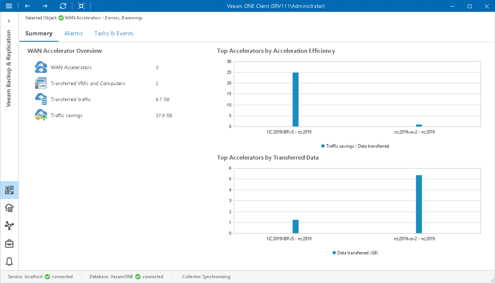

# WAN Accelerators Overview

The summary dashboard for the WAN Accelerators node provides a configuration overview and performance analysis for WAN accelerators managed by a backup server.

|  |
| --- |
| Note: |
| For WAN accelerators used in Veeam Cloud Connect jobs, performance data is available only if the target WAN accelerator is present in the Veeam ONE infrastructure. |

Charts in this dashboard can help you estimate the efficiency of VM and computer data transfer over WAN links. Comparing the amount of transferred and saved traffic, you can measure how the amount of VM and computer traffic was reduced by means of Veeam WAN acceleration.

WAN Accelerator Overview

The section provides the following details:

* Number of WAN accelerators managed by the backup server
* Number of VMs and computers stored in restore points transferred by WAN accelerators during backup copy job and replication job sessions
* Cumulative amount of network traffic transferred by WAN accelerators to the target destination (secondary repositories or replica datastore/volume)
* Cumulative amount of saved traffic — that is, the difference between the amount of VM or computer data that was read from the source location (source repository or datastore/volume) and the amount of data that was actually transferred to the target destination (secondary repository or replica datastore/volume)

Top Accelerators by Acceleration Efficiency

The chart shows 5 pairs of WAN accelerators that saved the greatest amount of traffic over the past 7 days.

To draw the chart, Veeam ONE analyzes the difference between the amount of VM or computer data read from the source location (source repository or datastore/volume) and the amount of data that was actually transferred to the target destination (secondary repository or replica datastore/volume) over the past 7 days.

Top Accelerators by Transferred Data

The chart shows 5 pairs of WAN accelerators that transferred the greatest amount of VM and computer data over the past 7 days.

Every graph in the chart shows the total amount of VM and computer data that was sent from the source-side accelerator to the target-side accelerator over the network.

