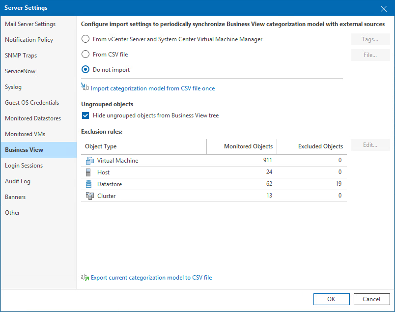

# Business View

On the Business View tab, you can define the following settings:

* [Categorization model](business_view.md#model) — choose whether you want to import an existing categorization model or create your own categories and groups.
* [Ungrouped objects](business_view.md#ungrouped) — hide ungrouped objects from the Business View inventory tree.
* [Defining Exclusions](#exclusions) — define objects that must be excluded from categorization.

For details on Business View categorization, see [Business View](bv.md).

Selecting Categorization Model

To select a categorization model:

1. Open Veeam ONE Client.

For details, see [Accessing Veeam ONE Components](access.md).

1. In the main menu, click Settings > Server Settings.

Alternatively, press [CTRL + S] on the keyboard.

1. In the Server Settings window, open the Business View tab.
2. Select one of the following categorization options:

* From vCenter Server and System Center Virtual Machine Manager — select this option if you have vCenter Server tags or System Center Virtual Machine Manager properties assigned to virtual infrastructure objects, and you want to use these tags and properties to categorize objects in Veeam ONE Client.
* From CSV file — select this option if you want to synchronize categorization data between Business View and a 3rd party application using a CSV file.

For details on configuring data synchronization, see [Importing Categorization Data Automatically](bv_import_export_csv.md#auto).

* Do not import — select this option if you want to create a custom categorization model in Business View.

For details on creating Business View categories, see [Creating Business View Categories and Groups](bv_create_categories.md).

* Import categorization model from CSV file once — select this option if you want to map categorization data from a 3rd party application to Business View groups using a CSV file.

For details on manual import from, see [Importing Categorization Data Manually](bv_import_export_csv.md#manual).

|  |
| --- |
| Note: |
| * You cannot enable synchronization with vCenter Server and System Center Virtual Machine Manager tags and properties and a CSV file at the same time. When you switch between these options or disable import, Veeam ONE Client deletes all previously imported categories. * Categorization model settings do not affect tags collection. For example, if you select the Do not import option, Veeam ONE will still collect vCenter Server tags or System Center Virtual Machine Manager properties, but will not use them for building categories and groups. |

Hiding Ungrouped Objects

To hide ungrouped objects from the Business View inventory tree:

1. Open Veeam ONE Client.

For details, see [Accessing Veeam ONE Components](access.md).

1. In the main menu, click Settings > Server Settings.

Alternatively, press [CTRL + S] on the keyboard.

1. In the Server Settings window, open the Business View tab.
2. In the Ungrouped objects section, select Hide ungrouped objects from Business View tree.

If you select Hide ungrouped objects from Business View tree check box, Veeam ONE Client will hide the Uncategorized group and all objects within this group from the Business View inventory tree.

For details on displaying the Business View inventory tree, see [Business View](inventory_pane.md#bv).

Defining Exclusions

To exclude objects from Business View categorization:

1. Open Veeam ONE Client.

For details, see [Accessing Veeam ONE Components](access.md).

1. In the main menu, click Settings > Server Settings.

Alternatively, press [CTRL + S] on the keyboard.

1. In the Server Settings window, open the Business View tab.
2. In the Exclusion rules section, select an object type and click Edit.
3. [For virtual infrastructure objects] Choose platform for which you want to define exclusions (VMware, Hyper-V).
4. In the Edit Global Exclusion Rule window, click Add Condition and specify exclusion conditions:

* From the Property drop-down list, select an object property.

The list contains all object properties that Veeam ONE collects from virtual and backup infrastructure servers.

* From the Operator drop-down list, select a conditional operator.

The list contains the following operators: Equals, Does not equal, Starts with, Ends with, Contains, Does not contain, Wildcard.

* In the Value field, specify a value that will be checked in the condition.

The condition will be evaluated against discovered objects. To add another condition, click Add Condition.

By default, conditions are linked by the AND operator. That is, an object is excluded when all specified conditions are met. You can change this behavior by linking conditions with the OR operator. In this case, Veeam ONE will exclude an object from categorization when a condition for any of the linked rules is met.

For example, you can exclude VMs based on their power state, datacenter name, and guest OS. If you want to exclude all powered on VMs that reside in datacenter Atlanta or run Linux as their guest OS, you must link these conditions. The second and the third conditions will be linked to each other with the OR operator. The first condition will be linked to them with the AND operator.

To link conditions:

1. Select check boxes next to the necessary conditions and click Link.

1. In the Rule Condition window, select a link operator and click OK.

Linking supports 3 levels of nesting.

1. Click Save.

