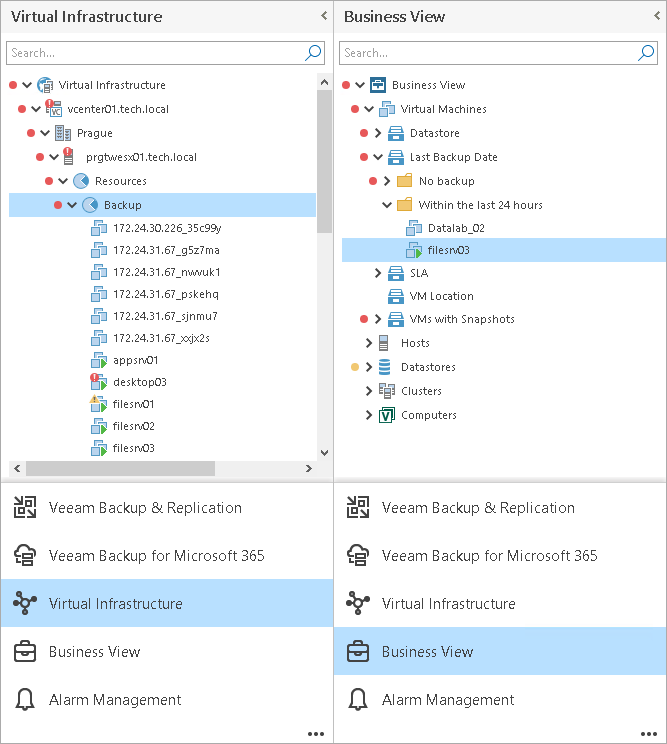

# Business View

Veeam ONE Client can present your virtual infrastructure from the technical perspective (in terms of VMware vSphere or Microsoft Hyper-V inventory), and from the business perspective (based on your company needs and priorities). Veeam ONE Client presents infrastructure objects from the business perspective using categorization capabilities provided by the embedded Business View component.

Business View allows you to categorize virtual and backup infrastructure objects — VMs, hosts, clusters, datastores, enterprise applications and computers protected with Veeam backup agents — according to constructs of your business. You can categorize virtual infrastructure objects by such criteria as business unit, department, purpose, SLA and others. Categorization data is continuously synchronized with Veeam ONE Client and Veeam ONE Web Client, and enables you to monitor, troubleshoot, resolve issues and report on business groups of infrastructure objects. For details on creating categories and groups for the objects in your infrastructure, see [Configuring Categorization Model](bv_categorization_model.md).

To work with the business view of your infrastructure in Veeam ONE Client, click Business View at the bottom of the inventory pane. In this view, you can use monitoring capabilities for business groups created for your virtual environment. For details on monitoring capabilities for Business View groups, see [Business View Monitoring](bv_monitoring.md).

In This Section

* [Configuring Categorization Model](bv_categorization_model.md)
* [Business View Monitoring](bv_monitoring.md)

