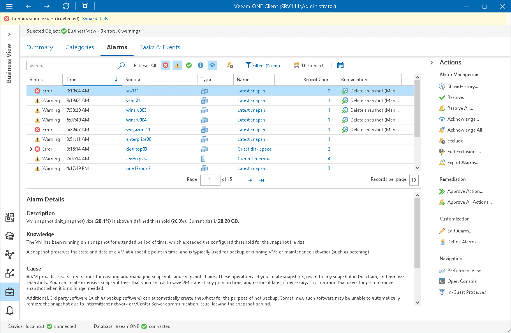

# Business View Alarms

You can create and manage alarms for virtual infrastructure objects organized into Business View groups. For example, you can group your virtual infrastructure objects by a department to which these objects belong. For each group, you can configure alarms with severity levels and thresholds corresponding to requirements of a specific department.

For Business View, Veeam ONE supports all alarms that apply to categorized objects — VMs, hosts, clusters, datastores, computers and enterprise applications.

To view the list of alarms for categorized objects:

1. Open Veeam ONE Client.

For details, see [Accessing Veeam ONE Components](access.md).

1. At the bottom of the inventory pane, click Business View.
2. In the inventory pane, select the necessary category, group or object.
3. Open the Alarms tab.

For more information, see [Working with Triggered Alarms](triggered_alarms.md).

