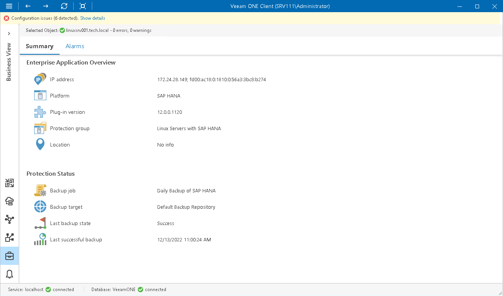

# Enterprise Application Details

The Summary dashboard for a single application node presents an overview and protection status details for applications protected with Veeam Plug-ins for SAP HANA, SAP on Oracle, Oracle RMAN and Microsoft SQL Server.

|  |
| --- |
| Note: |
| To be able to see enterprise application data in Veeam ONE, you must add the application into a protection group and configure a backup policy in Veeam Backup & Replication. For details on protection groups and application backup policies, see section [Veeam Plug-in Management](https://helpcenter.veeam.com/docs/backup/plugins/management.html) of the Veeam Plug-ins for Enterprise Applications Guide. |

Enterprise Application Overview

The section provides the following details:

* IP address of a machine on which the enterprise application is installed
* Enterprise application platform (SAP HANA, SAP on Oracle, Oracle, Microsoft SQL Server)
* Version of the enterprise application plug-in
* Name of the protection group in which the enterprise application is included
* Location of the enterprise application, as specified in Veeam Backup & Replication

Protection Status

The section provides the following details:

* Name of the backup job in which the enterprise application is included

* Target location in which enterprise application backups are stored

* The latest status of the backup job session (Success, Warning, Failed, Running, No Info)

* Date and time when the latest successful backup was created for the enterprise application

