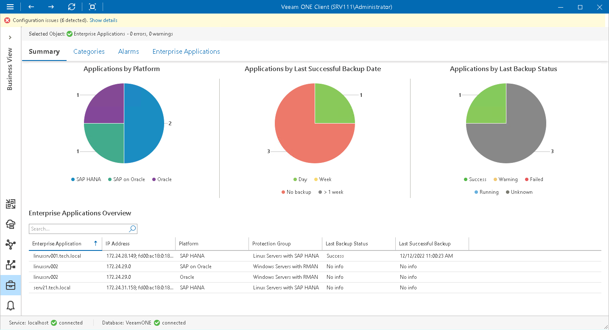

# Enterprise Applications Summary

The Enterprise Applications summary dashboard presents the health status overview for applications protected with Veeam Plug-ins for SAP HANA, SAP on Oracle, Oracle RMAN and Microsoft SQL Server. The dashboard scope includes applications whose backups are managed by Veeam Backup & Replication servers that you monitor in Veeam ONE.

|  |
| --- |
| Note: |
| To be able to see enterprise application data in Veeam ONE, you must add the application into a protection group and configure a backup policy in Veeam Backup & Replication. For details on protection groups and application backup policies, see section [Veeam Plug-in Management](https://helpcenter.veeam.com/docs/backup/plugins/management.html) of the Veeam Plug-ins for Enterprise Applications Guide. |

Applications by Platform

The chart displays types of application protected with enterprise application plug-ins.

Every chart segment shows the number of applications of a specific platform — the number of protected SAP HANA, SAP on Oracle, Oracle RMAN and Microsoft SQL Server applications.

Applications by Last Successful Backup Date

The chart displays the time interval when the latest successful backup was created for enterprise applications.

Every chart segment shows the number of computers with last successful backups created within a specific interval — the number of applications with backups created not older than a day ago, applications with backups created not older than a week ago, applications with backups older than a week, and applications with no backups.

Applications by Last Backup Status

The chart displays the latest status of backup jobs for enterprise applications.

Every chart segment shows how many jobs ended with a specific status — failed jobs, jobs that ended with warnings, successfully performed jobs, jobs that are currently running, and jobs whose status is unknown.

Enterprise Applications Overview

The table provides details on protected enterprise applications:

* Enterprise Application — name of the machine on which the enterprise application is installed.
* IP Address — IP address of the machine on which the enterprise application is installed.
* Platform — enterprise application platform (SAP HANA, SAP on Oracle, Oracle, Microsoft SQL Server).
* Protection Group — name of a protection group in which an application is included.
* Last Backup Status — the latest status of a backup job (Success, Warning, Failed, Running, No Info).
* Last Successful Backup — date and time when the latest successful backup was created for the enterprise application.

