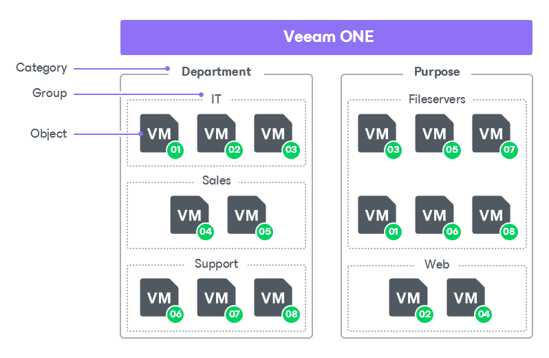

# Configuring Categorization Model

To present the virtual infrastructure, Veeam ONE Client uses the model that includes categories, groups and objects:

* Category is a logical division or a sector of the infrastructure. Each category includes one or more groups.

Categories can be static or dynamic:

+ Static categories include a user-defined number of groups. You can manually create groups that Veeam ONE will populate each time data collection runs.
+ Dynamic categories can include one or more groups that Veeam ONE creates and populates automatically each time data collection runs.

* Group is a collection of infrastructure objects that share same characteristics, or match same criteria. You can think of a group as a tag assigned to an object.

Each group includes one or more objects.

* Objects are categorized elements of the infrastructure.

In Veeam ONE Client you can categorize the following types of objects: clusters, hosts, storage objects, VMs, computers protected with Veeam backup agents and enterprise applications. You can include an object into one or more groups within a category.

The following picture illustrates an example of Veeam ONE categorization model.

In the example above, the categorization model includes categories Department and Purpose.

* Department category includes groups IT, Sales and Support
* Purpose category includes groups Fileservers and Web

Virtual machines numbered 1-8 are included in groups within both categories.

Predefined Categories

Out of the box, Veeam ONE Client comes with a number of predefined categories:

* Datastore — dynamically groups VMs by datastore where VM files reside.
* Location — dynamically groups by location computers managed by Veeam Backup & Replication.
* Last Backup Date — dynamically groups VMs, computers and enterprise applications by the age of the latest restore point.
* SLA — category with static groups for all types of virtual infrastructure objects. Includes two predefined groups: Mission Critical and Other.
* Storage Type — dynamically groups storage objects by type.
* VM Location — dynamically groups by location VMs protected with Veeam Backup & Replication.
* VMs with Snapshots — dynamically groups VMs with snapshots by the snapshot age.

You can use predefined categories for your categorization model. If predefined categories are not enough, you can create custom categories and edit predefined categories or import an existing categorization model.

In This Section

* [Creating Business View Categories and Groups](bv_create_categories.md)
* [Adding Objects to Groups Manually](bv_manual_categorization.md)
* [Editing Business View Categories](bv_edit_categories.md)
* [Deleting Business View Categories](bv_delete_categories.md)
* [Importing and Exporting Categorization Data](bv_import_categories.md)

