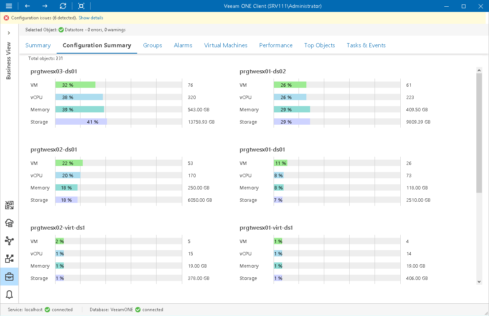

# Category Configuration Summary

The Configuration Summary dashboard displays categorization details for different types of virtual infrastructure objects.

The dashboard acts as detailed monitoring panel: it presents virtual infrastructure objects from the perspective of business view categories. For each category, Configuration Summary provides information on the groups included in the category, shows how many objects belong to these groups, and provides information on the total number of objects in a group of their vCPU, memory and storage resources.

At the top of the dashboard, Veeam ONE Client displays information on the total number of objects included in a category.

|  |
| --- |
| Note: |
| This dashboard is not available for the Computers and Enterprise Applications categories. |

Page updated 2026-07-31

