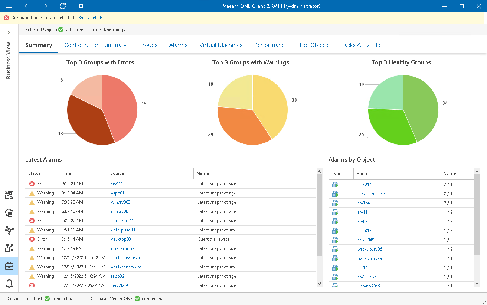

# Category Summary

The category summary dashboard provides an overview of the health status and performance for categorized infrastructure objects.

Top 3 Groups with Errors, Top 3 Groups with Warnings, Top 3 Healthy Groups

The charts reflect the health status of all groups within the chosen category.

Every chart segment represents groups in a certain state — groups with the greatest number of infrastructure objects with errors (red), groups with the greatest number of infrastructure objects with warnings (yellow) and groups with healthy infrastructure objects (green).

Click a chart segment to drill down to the list of alarms with the corresponding status for the selected Business View group.

Latest Alarms

The list displays the latest 15 alarms for the selected category. Click a link in the Source column to drill down to the list of alarms triggered for a specific infrastructure object.

Alarms by Object

The list displays 15 objects with the greatest number of alarms.

The value in the Alarms column shows the number of errors and warnings for an object. For example, 3/1 means that there are 3 errors and 1 warning triggered for the object. Click a link in the Source column to drill down to the list of alarms triggered for a specific infrastructure object.

For more information, see [Working with Triggered Alarms](triggered_alarms.md).

Page updated 2026-07-31

