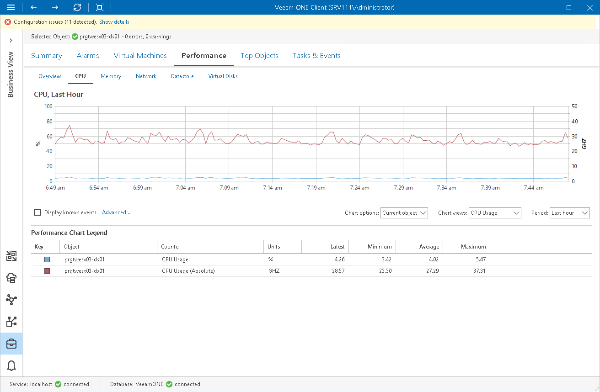

# Business View Performance Charts

You can launch performance charts for infrastructure objects organized into business groups. You can view the performance of objects in custom groups, and identify whether there are enough resources allocated to these objects.

For Business View, Veeam ONE supports all dashboards that apply to categorized virtual infrastructure objects — VMs, hosts, clusters and datastores.

To access a performance chart for a categorized virtual infrastructure object:

1. Open Veeam ONE Client.

For details, see [Accessing Veeam ONE Components](access.md).

1. At the bottom of the inventory pane, click Business View.
2. In the inventory pane, select the necessary object.
3. Open the necessary performance chart tab.

For details on performance charts, see [VMware vSphere Performance Charts](vsphere_charts.md) and [Microsoft Hyper-V Performance Charts](hyperv_charts.md).

