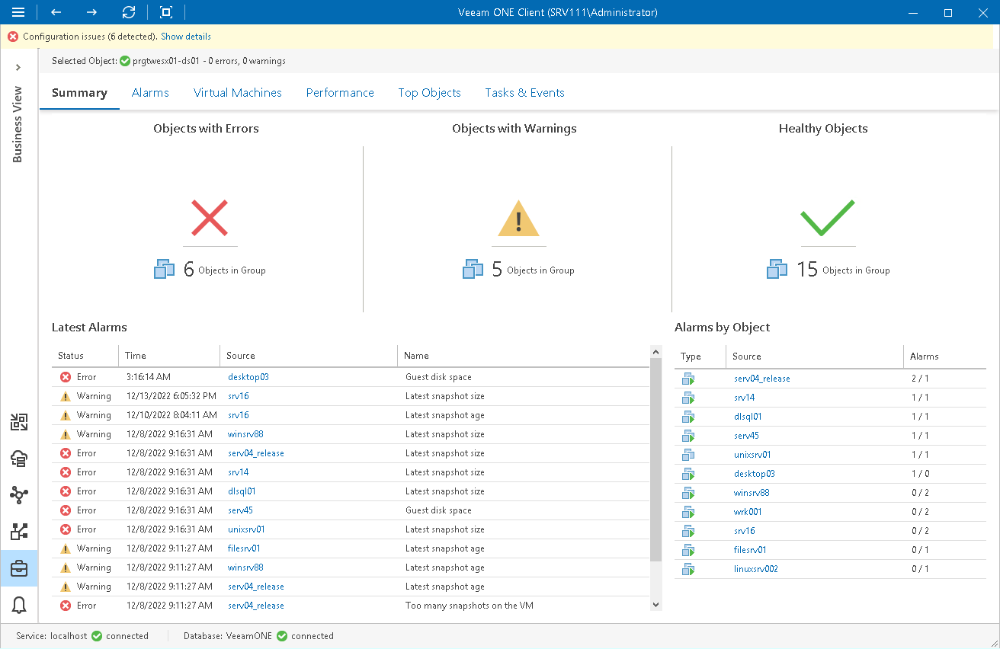

# Group Summary

The group summary dashboard provides an overview of the health status and performance for the virtual infrastructure objects that belong to the chosen group.

Error Objects, Warning Objects, Healthy Objects

The charts reflect the health status of virtual infrastructure objects in the group — objects with errors (red), objects with warnings (yellow) and healthy objects (green). Click the problematic chart to drill down to the list of alarms for objects with the chosen health status.

Latest Alarms

The list displays the latest 15 alarms for virtual infrastructure objects in the selected group. Click a link in the Source column to drill down to the list of alarms triggered for a specific virtual infrastructure object.

Alarms by Object

The list displays 15 objects with the greatest number of alarms.

The value in the Alarms column shows the number of errors and warnings for an object. For example, 3/1 means that there are 3 errors and 1 warning triggered for the object. Click a link in the Source column to drill down to the list of alarms triggered for a specific virtual infrastructure object.

For more information, see [Working with Triggered Alarms](triggered_alarms.md).

