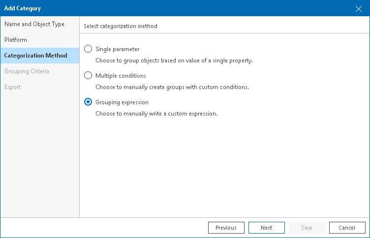
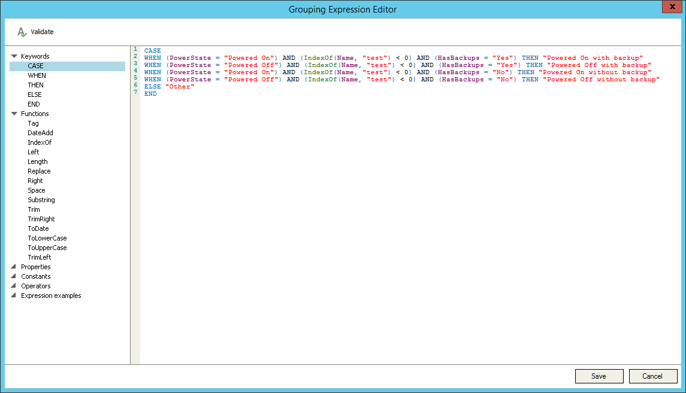
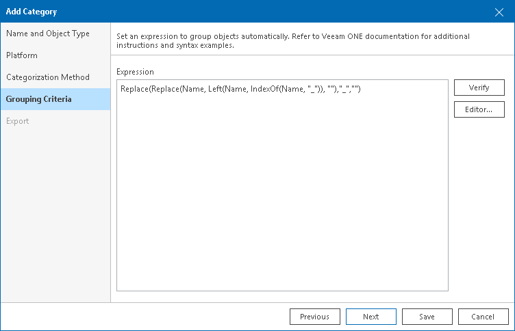

# Configuring Categorization Using Grouping Expressions

Grouping expressions are used to find objects that share common properties. When you configure categorization with grouping expression, Veeam ONE creates a set of groups, and includes objects with matching attributes into these groups.

Groups created with grouping expressions have dynamic membership. If the property value changes, the object can be moved into another group or excluded from categorization after the next data collection.

For example, you can create an expression that will divide VMs into groups by the guest OS name. Veeam ONE will create groups with the names of guest OSes that VMs in your infrastructure run. Each group will include VMs with the same guest OS.

To create groups using expressions:

1. Open Veeam ONE Client.

For details, see [Accessing Veeam ONE Components](access.md).

1. In the inventory pane, navigate to the Business View node.

1. Launch the Categorization Wizard:

1. In the information pane, switch to the Categories tab.
2. In the Actions pane, click Add Category.

Alternatively, in the Business View tree, right-click the main node and select Add Category.

1. At the Name and Object Type step, enter category name, select object type and click Next.

You can select the following types of objects: Virtual Machine, Host, Cluster, Storage, Computer, Enterprise Application.

If you select the Computer or Enterprise Application object type, continue with step 6 of this procedure.

1. At the Platform step of the wizard, select the platform for which you want to categorize objects.

1. At the Categorization Method step of the wizard, select Grouping expression.

1. At the Grouping Criteria step of the wizard, specify an expression that Veeam ONE must use to create groups and distribute infrastructure objects in these groups:

1. Click the Editor button to open the Grouping Expression Editor.
2. In the menu on the left, double click an item to add it to the Expression field.
3. Click Save to save the expression and exit the editor.

To check the created script, click the Verify button.

For details on the syntax of grouping expressions, see [Grouping Expressions Syntax](appendix_expressions_examples.md).

If you selected the Computer or Enterprise Application object type, click Save to finish working with the wizard.

1. At the Export step of the wizard, choose whether you want to export Business View categorization data:

* [For VMware vSphere objects] Select Create vSphere tags if you want to display Business View categories and groups in vCenter Server.

Veeam ONE will export categories as tag categories and groups as tags.

* [For Microsoft Hyper-V objects] Select Create Hyper-V custom properties if you want to display Business View categories and groups in System Center Virtual Machine Manager.

Veeam ONE will export categories as custom properties and groups as property values.

|  |
| --- |
| Note: |
| This step is not available if you enable import of categorization data from vCenter Server, System Center Virtual Machine Manager or a 3rd party application. For details on importing categorization model, see [Selecting Categorization Model](business_view.md#model). |

1. Click Save.

