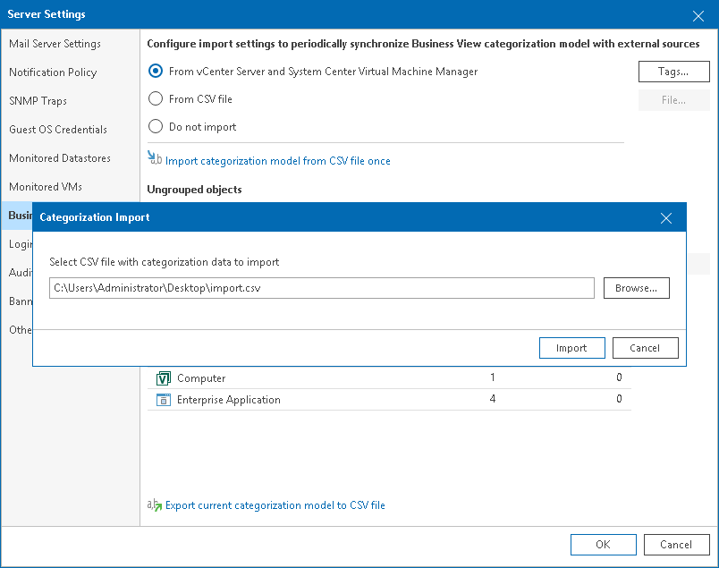
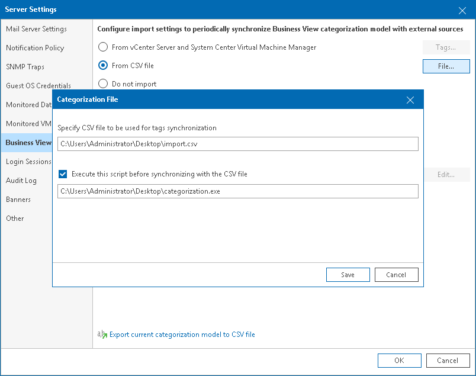
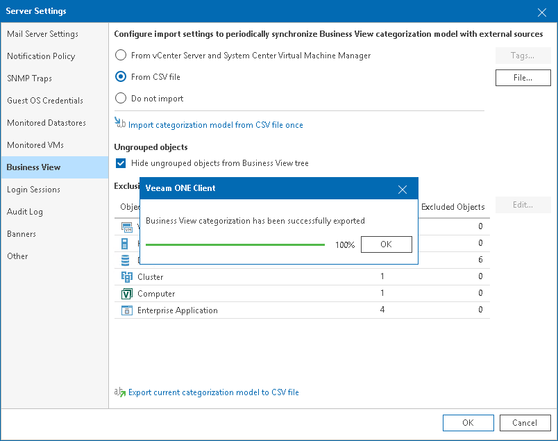

# Importing and Exporting Using CSV File

In Veeam ONE, you can import and export categorization model using a CSV file.

Importing Categorization Data Manually

If you already categorized the virtual infrastructure objects outside Veeam ONE, you can describe categorization model using a CSV file and then import this file to Veeam ONE.

When you import a CSV file manually, Veeam ONE creates categories and groups specified in the file and maps objects to these groups. If Veeam ONE detects in the imported CSV file categories and groups that already exist in Business View, it will map objects specified in the CSV file to existing groups. Imported objects have static membership, that is, they remain in the group until you manually reset categorization values. For details on manual mapping and resetting categorization values, see [Adding Objects to Groups Manually](bv_manual_categorization.md).

|  |
| --- |
| Note: |
| To make sure that Veeam ONE will process the CSV file without errors, check the file structure. For details on CSV file structure, see [CSV File Structure](bv_import_export_csv.md#fileStructure). |

To import categorization data from a CSV file:

1. Open Veeam ONE Client.

For details, see [Accessing Veeam ONE Components](access.md).

1. In the main menu, click Settings > Server Settings.

Alternatively, press [CTRL + S] on the keyboard.

1. In the Server Settings window, open the Business View tab.
2. Click the Import categorization model from CSV file once link.
3. In the Categorization Import window, specify the path to the CSV file with the categorization data you want to import.
4. Click Import.

Importing Categorization Data Automatically

You can synchronize categorization data between Veeam ONE and a 3rd party application every time data collection runs. To do this, you can specify a path to a CSV file with the categorization data exported from a 3rd party application. Veeam ONE will import data from this file during every data collection session.

Additionally, you can specify a path to a script that must be triggered before data from the CSV file is imported. This can be a script that creates the CSV file based on data from a 3rd party application, or updates the file. For details on structuring the file, see [CSV File Structure](#fileStructure).

|  |
| --- |
| Note: |
| If Veeam ONE detects in the specified CSV file categories that already exist in Business View, it will exclude such categories from synchronization. |

To configure periodic synchronization of categorization data between Veeam ONE and a 3rd party application:

1. Open Veeam ONE Client.

For details, see [Accessing Veeam ONE Components](access.md).

1. In the main menu, click Settings > Server Settings.

Alternatively, press [CTRL + S] on the keyboard.

1. In the Server Settings window, open the Business View tab.
2. Select From CSV file and click the File button.
3. In the Categorization File window, specify the path to the CSV file with the categorization data you want to synchronize.
4. If you want to trigger a custom script before data synchronization, select the Execute this script before synchronizing with a CSV file check box and specify a path to the script file.

|  |
| --- |
| Note: |
| The CSV and script files must reside in a folder that is accessible by Veeam ONE Monitoring Service. The account under which the service runs must have read permissions on the files. |

1. Click Save.

Exporting Categorization Data

To export Business View categorization data to a CSV file:

1. Open Veeam ONE Client.

For details, see [Accessing Veeam ONE Components](access.md).

1. In the main menu, click Settings > Server Settings.

Alternatively, press [CTRL + S] on the keyboard.

1. In the Server Settings window, open the Business View tab.
2. At the bottom of the window, click the Export current categorization model to CSV file link, specify the location where the file must be saved and click Save.
3. In the Veeam ONE Client window, click OK to acknowledge export results.

CSV File Structure

You can create a CSV file with categorization data from scratch. Every new record (row) in the file must describe an infrastructure object and its categorization data.

The following columns are mandatory for every record:

* Server — name of the managed virtual infrastructure or backup server to which object belongs.
* ObjectType — type of object (possible values are VirtualMachine, HostSystem, Storage, ClusterComputerResource, HvCluster, HvCsvDisk, HvHost, HvPhysicalDisk, HvVirtualMachine, VeeamBpAgent, SMBShare).
* MoRef — reference number of the object (for VMware vSphere), UUID or ID of the object (for Microsoft Hyper-V).

Other columns in the CSV file must be named as Business View categories. Category fields accept the following types of values:

* Name of a group within the category to which an infrastructure object belongs
* Empty field, if the object does not belong to any group within the category
* Excluded, if the object must be excluded from categorization

The following table shown as example of a CSV file for VMware vSphere VMs.

CSV File Structure

| Server | ObjectType | MoRef | Category1 |
| server.local | VirtualMachine | vm-01 | Group1 |
| server.local | VirtualMachine | vm-02 | Excluded |

