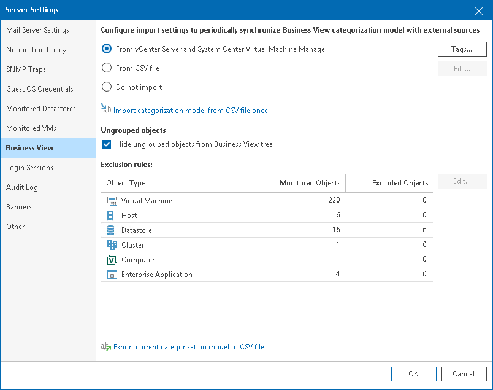
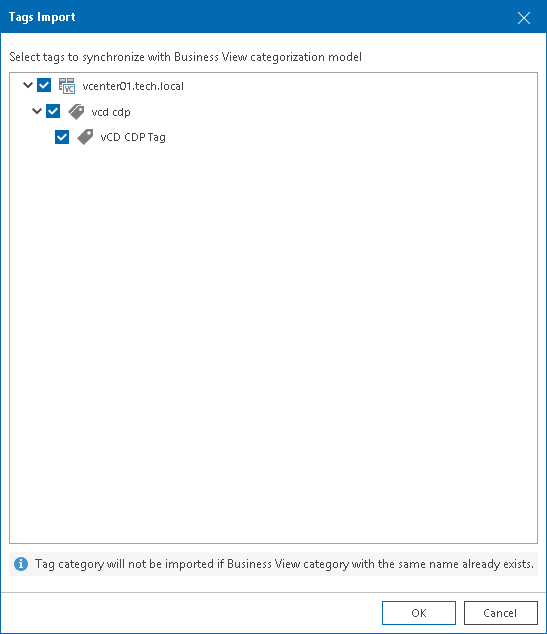

# Importing Categorization Model from vCenter Server and System Center Virtual Machine Manager

You can import categorization model from vCenter Server and System Center Virtual Machine Manager.

When you enable synchronization of categorization data from virtualization servers, Veeam ONE Client imports tags and custom properties and creates categories and groups according to the values of imported tags and properties. Every time data collection runs, Veeam ONE Client overwrites created categories and groups to keep categorization data in synchronization with vCenter Server and System Center Virtual Machine Manager.

|  |
| --- |
| Note: |
| Consider the following:   * Categories imported from vCenter Server and System Center Virtual Machine Manager are read-only, you cannot edit or delete them. To remove such categories from Business View tree, disable the option in Server Settings. For details on Business View Server Settings, see [Business View](business_view.md). * If Veeam ONE detects tags and custom properties with names that are already assigned to categories in Business View, it will exclude such tags and properties from synchronization. * While in categorization model imported from vCenter Server and System Center Virtual Machine Manager, if you create a new category, you will not be able to export it to tags. |

To import tags and custom properties:

1. Open Veeam ONE Client.

For details, see [Accessing Veeam ONE Components](access.md).

1. In the main menu, click Settings > Server Settings.

Alternatively, press [CTRL + S] on the keyboard.

1. In the Server Settings window, open the Business View tab.
2. Select From vCenter Server and System Center Virtual Machine Manager.

By default, Veeam ONE Client imports all tags and custom properties available on the vCenter Server and System Center Virtual Machine Manager side.

To select which tags and properties to import:

1. Click the Tags button.
2. Clear the check boxes next to tags that you want to exclude from import.

1. Click OK to save settings.

1. Click OK to close the Server Settings window.

Veeam ONE will import selected vCenter Server tags and System Center Virtual Machine Manager properties to create Business View categories and groups.

