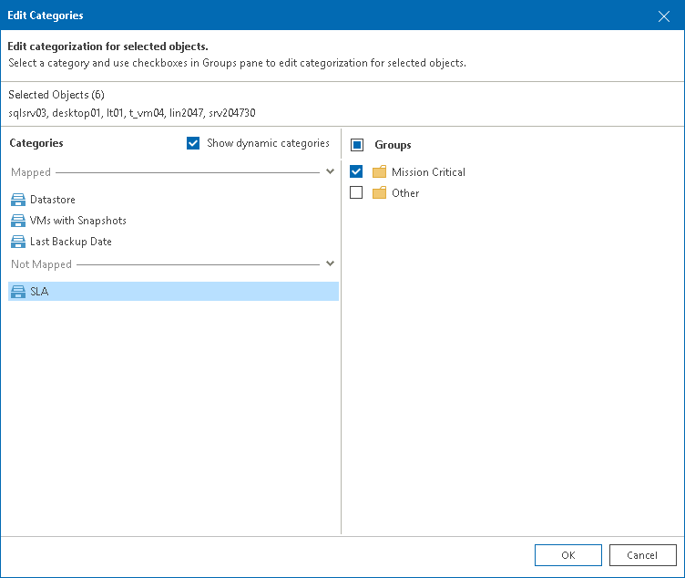

# Adding Objects to Groups Manually

You can manually add objects to groups in static categories — categories created with multiple-condition method and imported manually from a CSV file. When you map an object to a group, Veeam ONE adds the Manual selection condition to the group configuration. The name of an object acts as condition value. Mapped objects have static group membership, that is, they remain in the group until you manually reset categorization values. For details on resetting, see [Resetting Categorization Values](bv_manual_categorization.md#reset).

|  |
| --- |
| Tip: |
| To add objects to groups within multiple categories in a batch, you can describe these objects and groups in a CSV file and import this file to Veeam ONE Client. For details on importing categorization data from a CSV file, see [Importing and Exporting Using CSV File](bv_import_export_csv.md). |

Mapping Objects to Groups

To add objects to a group:

1. Open Veeam ONE Client.

For details, see [Accessing Veeam ONE Components](access.md).

1. In the inventory pane, navigate to the Business View node.
2. In the Business View tree, select the necessary object type — Virtual Machines, Hosts, Datastores, Clusters, Computers or Enterprise Applications.
3. Open the tab with the name of the object: Virtual Machines, Hosts, Datastores, Clusters, Computers, Enterprise Applications.
4. Select objects that you want to add to a group.

To quickly find necessary objects, use the scope drop-down list and search field at the top of the objects list.

Press and hold the [CTRL] or [SHIFT] key on the keyboard to select multiple objects.

1. In the Actions pane, click Manual Categorization.
2. In the Edit Categories window, select a category and groups to which you want to add objects.

The Categories section lists static categories to which you can add objects. To display all categories for the selected object type, select the Show dynamic categories check box.

1. Click OK to save the settings.

Resetting Categorization Values

You can remove objects from categories and groups to which you manually added these objects.

To remove objects from groups:

1. Open Veeam ONE Client.

For details, see [Accessing Veeam ONE Components](access.md).

1. In the inventory pane, navigate to the Business View node.
2. In the Business View tree, select the necessary object type — Virtual Machines, Hosts, Datastores, Clusters, Computers or Enterprise Applications.
3. Open the tab with the name of the object: Virtual Machines, Hosts, Datastores, Clusters, Computers, Enterprise Applications.
4. Select objects for which you want to reset categorization.

To quickly find necessary objects, use the scope drop-down list and search field at the top of the objects list.

Press and hold the [CTRL] or [SHIFT] key on the keyboard to select multiple objects.

1. In the Actions pane, click Reset Categorization.
2. In the Reset Manual Categorization window, click OK to confirm object removal.

