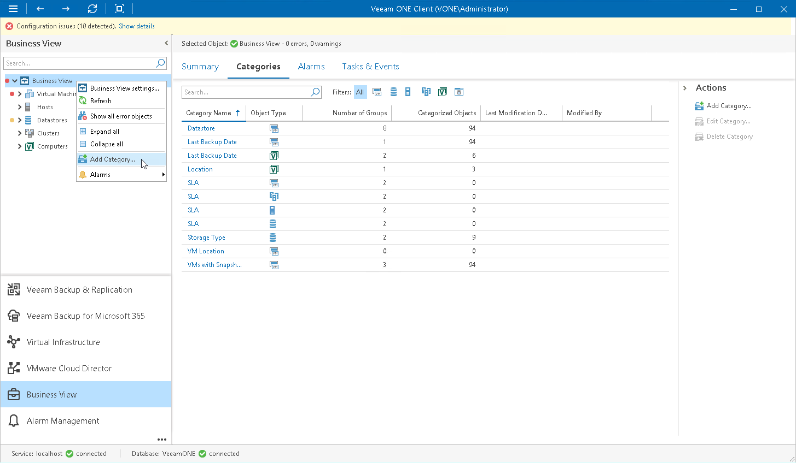
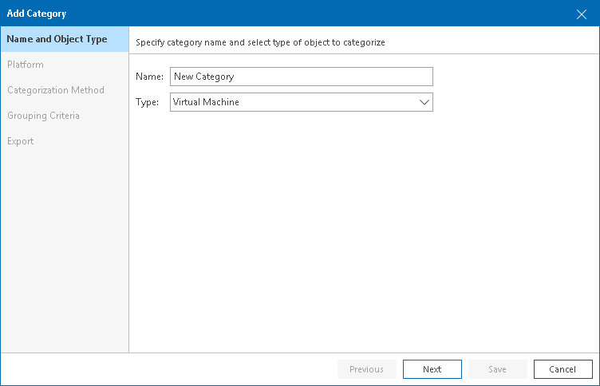
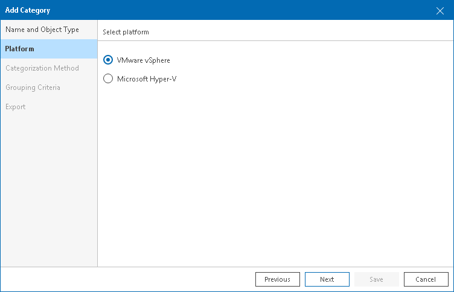
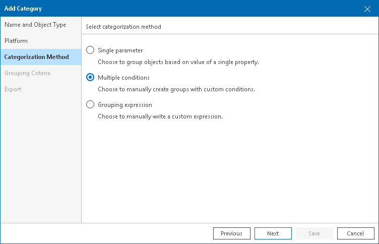
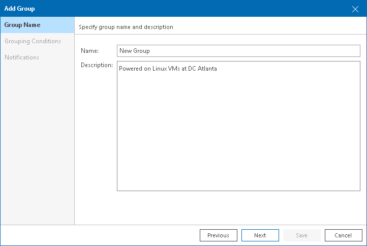
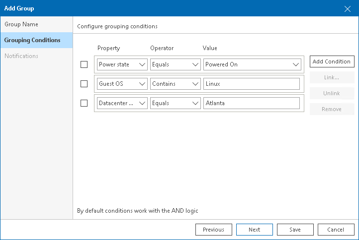
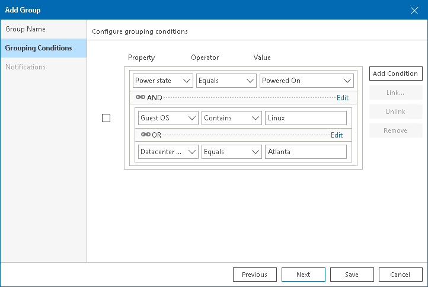
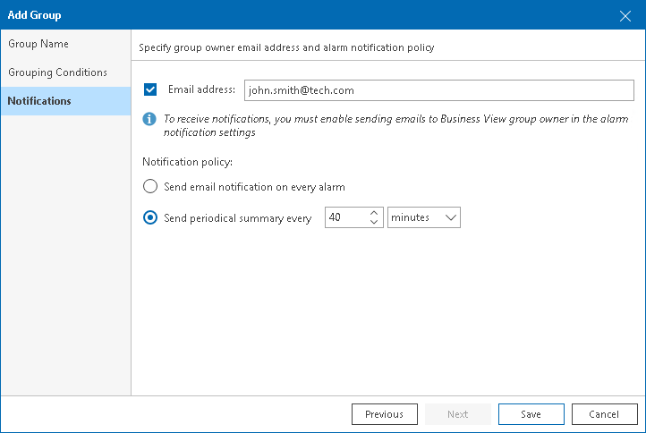
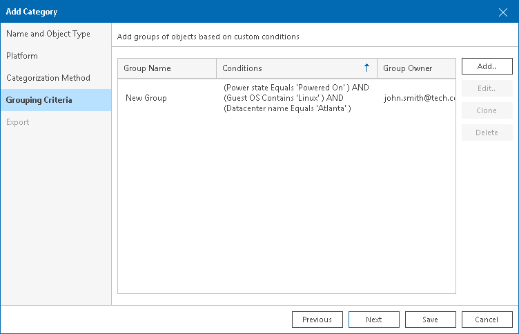
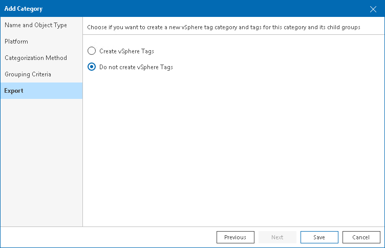

# Configuring Multiple-Condition Categorization

Multiple-condition categorization allows you to combine multiple conditions that evaluate object properties for creating groups. This method makes categories highly customizable, as each group within a category can have its own condition. Conditions can be based on different object properties and logical operators. For one group, you can specify one or more conditions and link them with the AND and OR operators.

Groups created with the multiple-condition method have dynamic membership. If the property value changes, the object can be moved into another group or excluded from categorization after the next data collection.

For example, you can categorize VMs based on their power state, datacenter name and guest OS at the same time. If any of these properties change, the VM will be moved into another group or excluded from categorization.

To create groups using multiple conditions:

1. Open Veeam ONE Client.

For details, see [Accessing Veeam ONE Components](access.md).

1. In the inventory pane, navigate to the Business View node.
2. Launch the Categorization Wizard:

1. In the information pane, switch to the Categories tab.
2. In the Actions pane, click Add Category.

Alternatively, in the Business View tree, right-click the main node and select Add Category.

1. At the Name and Object Type step of the wizard, enter a category name and select an object type.

You can select the following types of objects: Virtual Machine, Host, Cluster, Storage, Computer, Enterprise Application.

If you select the Computer or Enterprise Application object type, continue with step 6 of this procedure.

1. At the Platform step of the wizard, select the platform for which you want to categorize objects.

1. At the Categorization Method step of the wizard, select Multiple conditions.

1. At the Grouping Criteria step of the wizard, click Add to create groups based on multiple conditions.

The Add Group wizard will open.

1. At the Group Name step of the wizard, specify a group name and description.

1. At the Grouping Conditions step of the Add Group wizard, set up categorization conditions:

* From the Property drop-down list, select an object property.

The list contains all object properties that Veeam ONE collects from a hypervisor and Veeam Backup & Replication servers.

* From the Operator drop-down list, select a conditional operator.

The list contains the following operators: Equals, Does not equal, Starts with, Contains, Does not contain.

* In the Value field, specify a value that will be checked in the condition.

The condition will be evaluated against discovered objects. To add another condition, click Add Condition.

By default, conditions are linked by the AND operator. That is, an object falls into a group when all specified conditions are met. You can change this behavior by linking conditions with the OR operator. In this case, an object will fall into a group when a condition for any of the linked rules is met.

For example, you can create a group which will include VMs based on their power state, datacenter name and guest OS. If you want the group to include all powered on VMs that reside in datacenter Atlanta or run Linux as their guest OS, you must link these conditions. The second and the third conditions will be linked to each other with the OR operator. The first condition will be linked to them with the AND operator.

|  |
| --- |
| Note: |
| Linking supports 3 levels of nesting. |

To link conditions:

1. Select check boxes next to the necessary conditions and click Link.
2. In the Rule condition window, select a link operator and click OK.

1. [Optional] At the Notifications step of the wizard, specify notification settings:

1. Select the Email address check box and specify an email address of a person who will receive notifications about alarms triggered for the objects in a group (group owner).

To receive alarm notifications, enable the Send email to Business View group owner option in alarm settings. For details on configuring alarm notification settings, see [Specify Alarm Notification Options](alarm_notifications.md).

1. Choose the notification policy:

* Send email notification on every alarm — select this option if you want to send an email notification every time a new alarm is triggered or the status of an existing alarm changes.
* Send periodical summary every — select this option and if you want to accumulate information about alarms and send an email notification once within a specific time interval. You can specify the time interval in minutes or hours.

1. Click Save to save a group configuration and close the Add Group wizard.

Group settings will appear in the Categorization Wizard.

1. Repeat steps 7-11 for each group you want to configure in the category.

If you selected the Computer or Enterprise Application object type, click Save to finish working with the wizard.

1. At the Export step of the wizard, choose whether you want to export Business View categorization data:

* [For VMware vSphere objects] Select Create vSphere tags if you want to display Business View categories and groups in vCenter Server.

Veeam ONE will export categories as tag categories and groups as tags.

* [For Microsoft Hyper-V objects] Select Create Hyper-V custom properties if you want to display Business View categories and groups in System Center Virtual Machine Manager.

Veeam ONE will export categories as custom properties and groups as property values.

Veeam ONE will periodically overwrite created tags and custom properties to keep categorization data in synchronization with vCenter Server and System Center Virtual Machine Manager.

|  |
| --- |
| Note: |
| This step is not available if you enable import of categorization data from vCenter Server, System Center Virtual Machine Manager. For details on importing categorization model, see [Selecting Categorization Model](business_view.md#model). |

1. Click Save.

