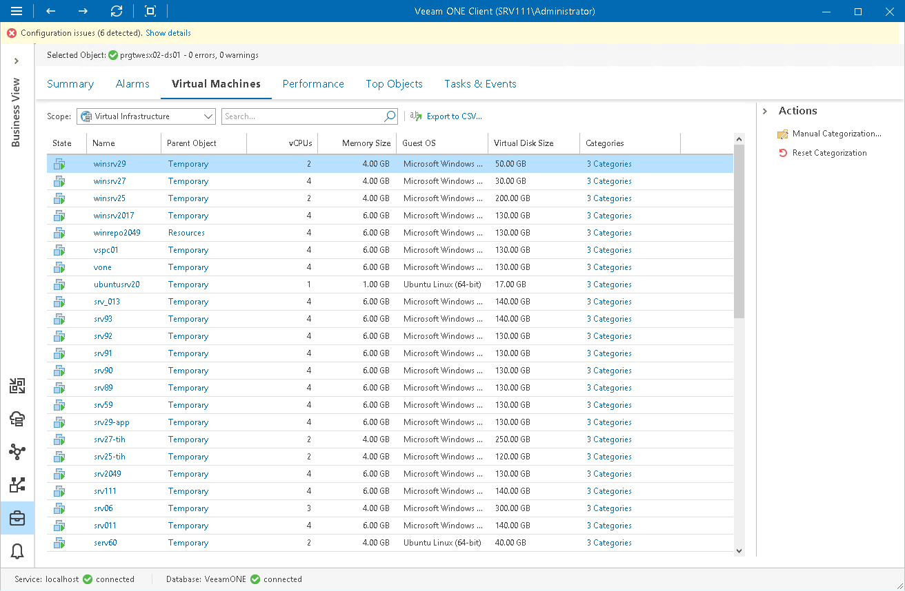

# Business View Objects

You can view the list of infrastructure objects within the Business View node — object type, platform, category and group.

To view the list of objects:

1. Open Veeam ONE Client.

For details, see [Accessing Veeam ONE Components](access.md).

1. At the bottom of the inventory pane, click Business View.
2. In the inventory pane, select the necessary node.
3. Open the tab with the name of the object: Virtual Machines, Hosts, Datastores, Clusters, Computers, Enterprise Applications.
4. To find the necessary object by name, use the Search field at the top of the list.

To display objects of a specific virtual infrastructure node, select the necessary node in the Scope field at the top of the list.

1. Click column names to sort objects by a specific parameter.

For every object in the list, the following details are available.

Virtual Machines

* State — state of the VM (powered on, powered off, suspended)
* Name — name of the VM
* Parent Object — name of the parent object for the VM

Click a link in this column to switch to the Virtual Infrastructure for the parent object.

* vCPUs — number of virtual CPUs configured for the virtual machine
* Memory Size — amount of memory resources allocated to the VM
* Guest OS — guest operating system installed on the VM
* Virtual Disk Size — size of the VM virtual disk
* Categories — number of categories to which the VM is included

Click a link in this column to see all categories and groups in which the VM is included.

Hosts

* Name — name of the host

* Parent Object — name of the parent object for the host

Click a link in this column to switch to the Virtual Infrastructure for the parent object.

* CPU Count — number of CPU cores on the host
* CPU Speed — frequency of CPU cores on the host

* Memory Size — total capacity of the host

* VM Count — number of VMs residing on the host

* Categories — number of categories to which the host is included

Click a link in this column to see all categories and groups in which the host is included.

Datastores

* Datastores — name of the datastore

* Parent Object — name of the parent object for the datastore

Click a link in this column to switch to the Virtual Infrastructure for the parent object.

* File System — type of the file system on the datastore
* Capacity — total capacity of the datastore
* Free Space — free space remaining on the datastore
* VM Count — number of VMs residing on the datastore

* Categories — number of categories to which the datastore is included

Click a link in this column to see all categories and groups in which the datastore is included.

Clusters

* Clusters — name of the cluster

* Parent Object — name of the parent object for the cluster

Click a link in this column to switch to the Virtual Infrastructure for the parent object.

* CPU Count — number of CPU cores in the cluster
* CPU Speed — total frequency of all CPU cores in the cluster
* Memory Size — total size of memory available for the cluster
* Host Count — number of hosts in the cluster
* VM Count — number of VMs residing on the cluster

* Categories — number of categories to which the cluster is included

Click a link in this column to see all categories and groups in which the cluster is included.

Computers

* Name — name of the computer on which Veeam backup agent is installed
* IP Address — IP address of the computer on which Veeam backup agent is installed
* Cluster — name of a failover cluster added to a protection group
* Agent Type — type of the computer OS and mode in which Veeam backup agent job runs (Windows Server, Windows Workstation, Linux Server, Linux Workstation, Mac Server, Mac Workstation, Solaris Server or AIX Server)
* Location — location assigned to the computer in Veeam Backup & Replication
* Agent Version — version of the Veeam backup agent
* Protection Group — name of the protection group to which the computer is included
* Backup Server — name of the Veeam Backup & Replication server that manages the Veeam backup agent
* Backup Job / Policy — name of the backup job or policy assigned to the Veeam backup agent on the computer
* Last Backup State — state of the latest job session
* Last Successful Backup — date and time when the latest restore point was created

* Categories — number of categories to which the computer is included

Click a link in this column to see all categories and groups in which a computer is included.

Enterprise Applications

* Name — name of the machine on which the enterprise application plug-in is installed
* IP Address — IP address of the machine on which the enterprise application plug-in is installed
* Platform — enterprise application platform
* Location — location assigned to the application in Veeam Backup & Replication
* Plug-in Version — version of the Veeam Plug-in
* Protection Group — name of the protection group to which the application is included
* Backup Server — name of the Veeam Backup & Replication server that manages the Veeam Plug-in
* Backup Policy — name of the backup job or policy assigned to the Veeam Plug-in
* Last Backup State — state of the latest job session
* Last Successful Backup — date and time when the latest restore point was created
* Categories — number of categories to which the application is included

Click a link in this column to see all categories and groups in which a computer is included.

You can choose what columns to show or hide in the objects table:

* To hide one or more columns, right-click the table header, and clear check boxes next to the corresponding data fields.
* To make hidden columns visible, right-click the table header, and select check boxes next to the corresponding data fields.

Exporting Object Details to CSV

You can export categorization data to a CSV file and save it for documenting purposes:

1. Open Veeam ONE Client.

For details, see [Accessing Veeam ONE Components](access.md).

1. At the bottom of the inventory pane, click Business View.
2. In the inventory pane, select the necessary node.
3. Open the tab with the name of the object: Virtual Machines, Hosts, Datastores, Clusters, Computers, Enterprise Applications.
4. To find the necessary object by name, use the Search field at the top of the list.
5. At the top of the list, click Export to CSV and save the file.

