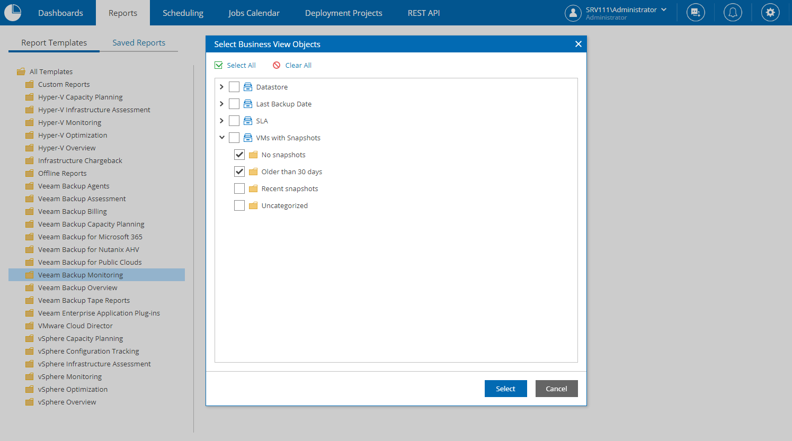
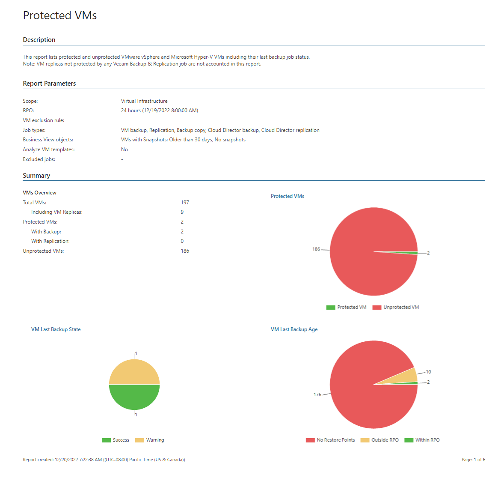

# Business View Reporting

Veeam ONE Web Client integrates with Business View and allows you to create reports and dashboards for business view groups. For example, if you group VMs by department, you can create reports for a specific department in your organization.

The following example shows how you can create the Protected VMs report for specific business view groups:

1. Open Veeam ONE Web Client.
2. Open the Reports section.
3. In the hierarchy on the left, select the Veeam Backup Monitoring folder.
4. In the displayed list of reports, click the Protected VMs report.
5. From the Business view objects list, select business groups for which you want to create a report.
6. Specify other report parameters and click Preview.

Veeam ONE Web Client will present data from the business point of view — that is, for the selected business groups.

