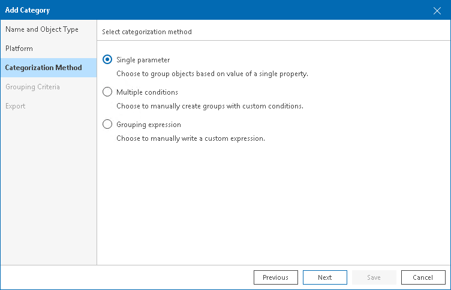
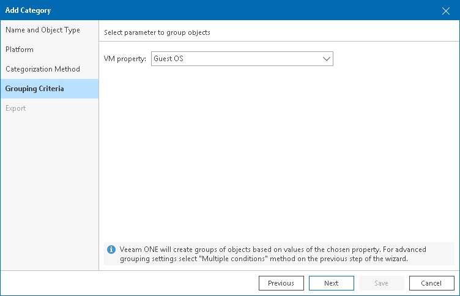

# Configuring Single-Parameter Categorization

Single-parameter categorization is based on object properties specified within a hypervisor and Veeam Backup & Replication server. When you select a property as a categorization condition, Veeam ONE automatically creates a group for each unique value of the selected property. All objects with the same property value will fall into one group.

Groups created using the single property method have dynamic membership. If the property value changes, the object can be moved into another group or excluded from categorization when the next data collection runs.

For example, you can categorize VMs based on their power state. After data collection, Veeam ONE will create three groups: Powered On, Powered Off and Suspended. If a VM power state changes, this VM will be moved into another group next time data collection runs.

To categorize objects using a single property:

1. Open Veeam ONE Client.

For details, see [Accessing Veeam ONE Components](access.md).

1. In the inventory pane, navigate to the Business View node.
2. Launch the Categorization Wizard:

1. In the information pane, switch to the Categories tab.
2. In the Actions pane, click Add Category.

Alternatively, in the Business View tree, right-click the main node and select Add Category.

1. At the Name and Object Type step of the wizard, enter a category name and select an object type.

You can select the following types of objects: Virtual Machine, Host, Cluster, Storage, Computer, Enterprise Application.

If you select the Computer or Enterprise Application object type, continue with step 6 of this procedure.

1. At the Platform step of the wizard, select the platform for which you want to categorize objects: VMware vSphere or Microsoft Hyper-V.

1. At the Categorization Method step of the wizard, select Single parameter.

1. At the Grouping Criteria step of the Categorization Wizard, select an object property.

If you selected the Computer or Enterprise Application object type, click Save to finish working with the wizard.

1. At the Export step of the wizard, choose whether you want to export Business View categorization data:

* [For VMware vSphere objects] Select Create vSphere tags if you want to display Business View categories and groups in vCenter Server.

Veeam ONE will export categories as tag categories and groups as tags.

* [For Microsoft Hyper-V objects] Select Create Hyper-V custom properties if you want to display Business View categories and groups in System Center Virtual Machine Manager.

Veeam ONE will export categories as custom properties and groups as property values.

Veeam ONE will periodically overwrite created tags and custom properties to keep categorization data in synchronization with vCenter Server and System Center Virtual Machine Manager.

|  |
| --- |
| Note: |
| This step is not available if you enable import of categorization data from vCenter Server, System Center Virtual Machine Manager. For details on importing categorization model, see [Selecting Categorization Model](business_view.md#model). |

1. Click Save.

Veeam ONE will create an individual group for each unique value of the selected property.

