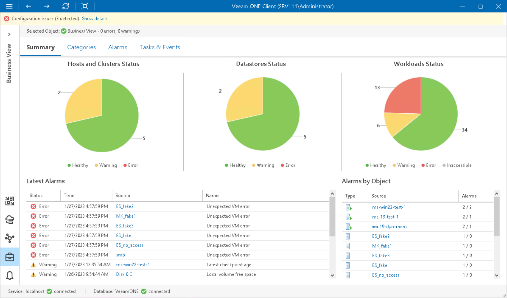

# Business View Summary

The Business View summary dashboard presents the health status overview for objects in all available Business View groups.

Host and Clusters Status, Datastores Status, Workloads Status

The charts reflect the health status of virtual infrastructure objects in Business View groups.

Every chart segment represents the number of objects in a certain state — objects with errors (red), objects with warnings (yellow) and healthy objects (green). Click a chart segment or a legend label to drill down to the list of alarms with the corresponding status for the selected type of virtual infrastructure objects.

Latest Alarms

The list displays the latest 15 alarms for objects in available Business View groups. Click a link in the Source column to drill down to the list of alarms triggered for a specific virtual infrastructure object.

Alarms by Object

The list displays 15 objects with the greatest number of alarms.

The value in the Alarms column shows the number of errors and warnings for an object. For example, 3/1 means that there are 3 errors and 1 warning triggered for the object. Click a link in the Source column to drill down to the list of alarms triggered for a specific virtual infrastructure object.

For more information, see [Working with Triggered Alarms](triggered_alarms.md).

