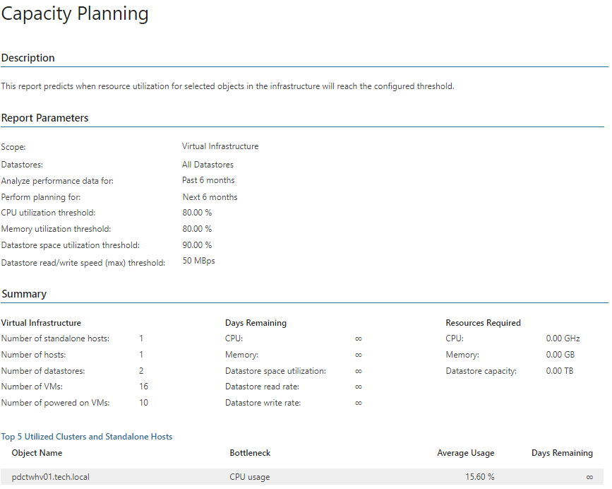

# Capacity Planning (Hyper-V)

This report forecasts how many days remain before the level of resource utilization reaches the specified threshold values. The report allows you to analyze the following resource utilization parameters: CPU, memory, datastore free space, read and write rates.

* The Summary section provides an overview of the infrastructure (the total number of hosts, datastores and VMs), shows the number of days left before specified thresholds will be reached, and the amount of resources required to sustain the current workloads without exceeding the specified thresholds.

+ The Top 5 Utilized Clusters and Standalone Host table displays objects that will run out of CPU or memory resources sooner than others. It shows the bottleneck parameter for each object and its average usage. This data is used to predict how many days are left before the object reaches the threshold.

Some values in this section may be highlighted with red. If a value in the Average Usage column is highlighted with red, the resource usage value has reached the specified threshold. The Days Remaining value is highlighted with red if the number of days left until the parameter reaches the threshold is less than 183 (6 months).

* The Details section displays host hardware configuration and resource usage, analyzes historical performance data for the specified period in the past to calculate the performance utilization trend, and provides recommendations on how to keep the resource utilization below the specified thresholds.

Report Parameters

You can specify the following report parameters:

* Infrastructure objects: defines virtual infrastructure objects and sub-components you want to analyze in the report.
* Datastores: defines a list of datastores to analyze in the report.
* Analyze performance data for: defines a time period in the past the report will use to accumulate performance data and calculate the performance trend.
* Perform planning for: defines a time period in the future for which performance data will be used to forecast resource usage trend.
* CPU utilization (%): defines the CPU usage threshold as a percentage of total CPU resources of virtual infrastructure objects.
* Memory utilization (%): defines the used memory threshold as a percentage of total memory resources of virtual infrastructure objects.
* Space utilization (%): defines the maximum amount of space in use on a datastore.
* Free space (min): defines the minimum amount of free space left on a datastore in GB.
* Read/write speed (max): defines the maximum read and write rates in MB per second for a datastore.
* Business hours from - to: defines time of a day for which historical performance data will be used to calculate the performance trend. All data beyond this interval will be excluded from the baseline used for data analysis.
* Show graphs: defines whether the report must include charts that illustrate historical performance data for the specified period.

Use Case

This report helps you plan workloads to avoid resource shortage. It analyzes historical performance to calculate typical resource utilization. The report extrapolates received data to the future to predict when you will run out of resources and provide recommendations on resources you need to add to maintain stable operation.

