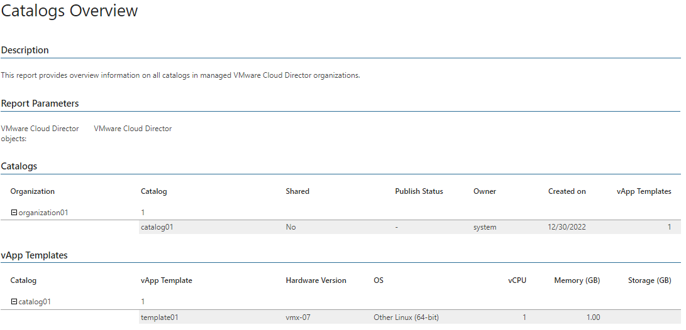

# Catalogs Overview

This report displays an inventory of catalogs created for selected organizations.

* The Catalogs table provides information on catalogs for each organization, including catalog name, sharing status, publish status, catalog owner, date when catalog was created and number of vApp templates.

* The vApp Templates table provides information on vApp templates stored in the catalog, including template name, hardware version, OS and allocated vCPU, memory and storage resources.

Report Parameters

You can specify the following report parameters:

* VMware Cloud Director objects: defines a list of organizations to analyze in the report.

Use Case

Outdated catalog data consume valuable cloud resources. Use this report to review content of VMware Cloud Director catalogs and to track the amount of space consumed by catalog content across organizations.

Page updated 2026-07-30

