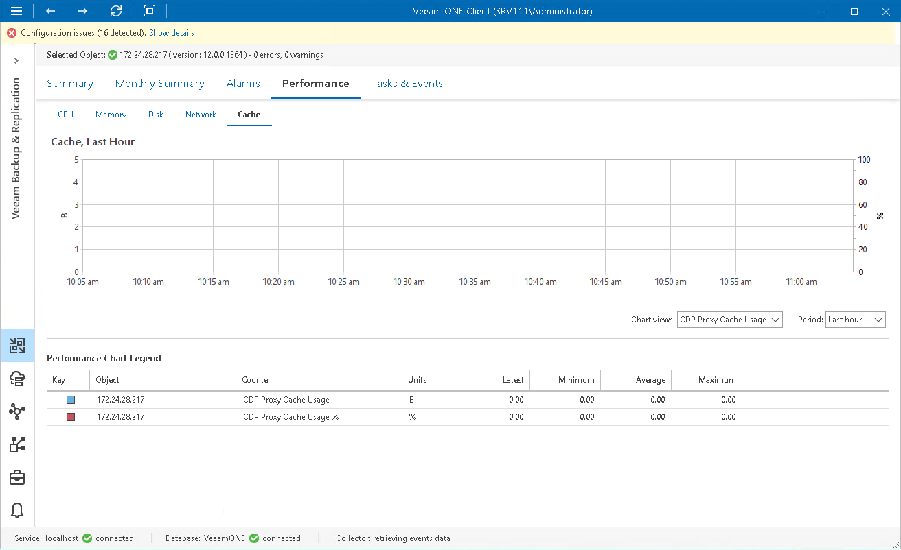

# Cache Performance Chart

The Cache chart shows the amount of space consumed by the data processed during CDP operations. Graphs in the chart display how much data is stored in the cache folder on the machine where CDP Proxy component runs and the percentage of allocated cache space consumed by this data.

