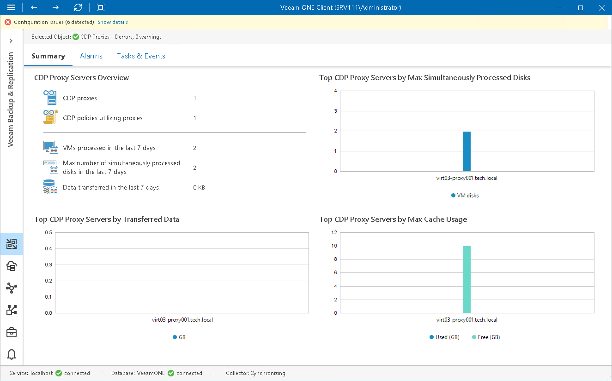

# CDP Proxy Servers Overview

The summary dashboard for the CDP Proxies node provides a configuration overview and performance analysis for CDP proxies managed by a backup server.

CDP Proxy Servers Overview

The section provides the following details:

* Number of CDP proxies configured on the backup server.
* Number of CDP policies configured to use proxies
* Number of VMs that CDP proxies have processed in the last 7 days
* Maximum number of VM disks that proxies have simultaneously processed in the last 7 days
* Total amount of data that proxies have processed during the last 7 days

Top CDP Proxy Servers by Max Simultaneously Processed Disks

The chart shows 5 CDP proxies that simultaneously processed the greatest number of VM disks over the last 7 days.

To draw the chart, Veeam ONE analyzes how many disks were successfully processed by every proxy.

The chart helps you detect the most heavily loaded CDP proxies and optimize the performance of your backup infrastructure. If specific proxies are overloaded with disk processing tasks, and the tasks often need to wait for proxy resources, you may need to deploy additional proxies or balance the processing load by assigning policies to other proxies.

Top CDP Proxy Servers by Transferred Data

The chart shows 5 CDP proxies that transferred the greatest amount of VM data to the target host over the last 7 days.

For every proxy, the chart shows the total amount of data that the proxy transferred over the network after the source-side deduplication and compression. The chart can help you detect proxies that transfer the greatest amount of data and estimate the load that CDP sessions impose on the network.

Top CDP Proxy Servers by Max Cache Usage

The chart shows 5 CDP proxies that used the maximum amount of space allocated for storing cache over the last 7 days.

For every proxy, the chart shows the amount of free and used space allocated for cache storage. The chart can help you detect proxies that store the greatest amount of temporary cached data and estimate which proxies require allocating more storage space.

