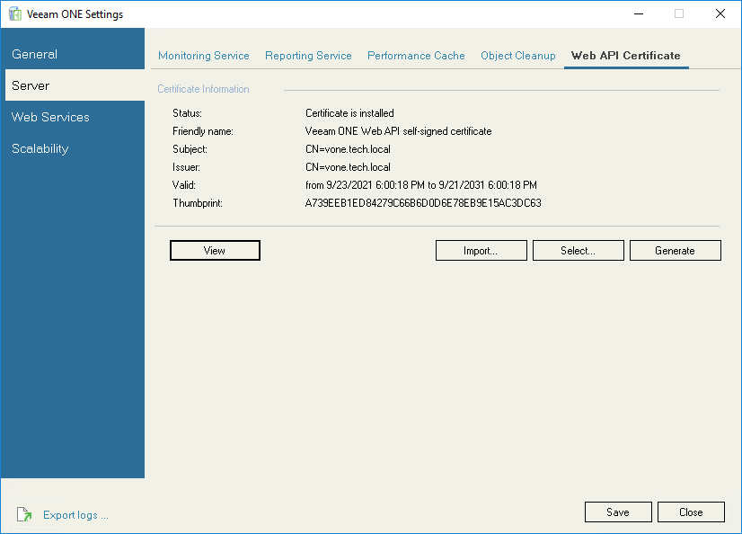

# Importing Certificate from Certificate Store

If Veeam ONE Server has been issued a TLS certificate signed by a CA and the TLS certificate is located in the Microsoft Windows certificate store, you can use this certificate to establish a secure connection between Veeam ONE components.

To select a certificate from the Microsoft Windows certificate store, do the following on the machine where Veeam ONE server component is installed:

1. Run the Veeam ONE Settings utility.

For more information, see [Veeam ONE Settings Utility](appendix.md).

1. In the Server section, open the Web API Certificate tab.
2. Click Select and select the certificate from the Trusted Root Certificate Authorities store.

