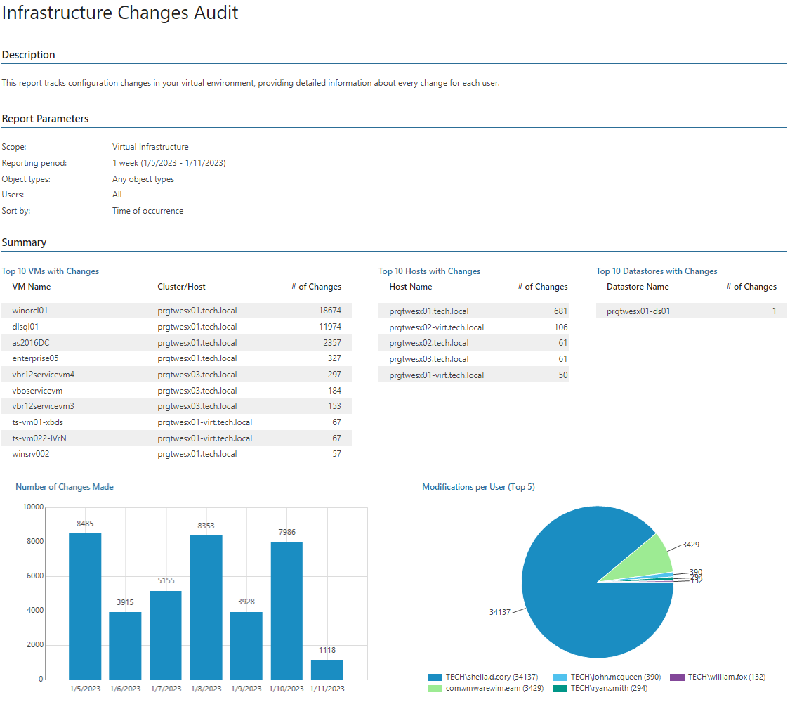
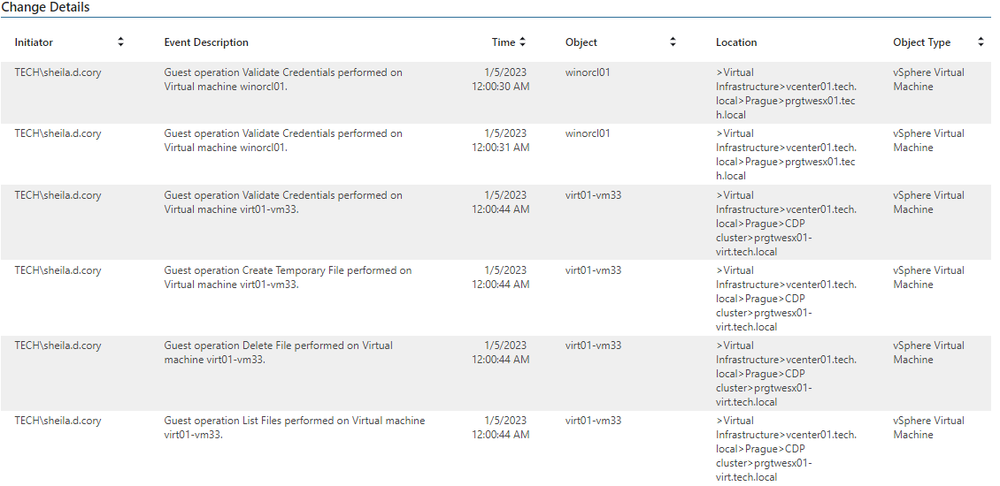

# Infrastructure Changes Audit

This report analyzes virtual infrastructure configuration changes and provides information on users who performed these changes.

* The Summary section includes the following elements:

+ The Top 10 VMs/Hosts/Datastores with Changes tables show VMs, hosts and datastores with the biggest number of changes.
+ The Number of Changes Made chart shows how many changes were made during the reporting period.
+ The Modifications per User (Top 5) chart shows users who made the most changes during the reporting period.

* The Change Details table provides information on changes made, including initiator, event description, changed object name, location and type, and date and time when event occurred.

Report Parameters

You can specify the following report parameters:

* Infrastructure objects: defines a virtual infrastructure level and its sub-components to analyze in the report.
* Business View objects: defines Business View groups to analyze in the report.

Business View groups from the same category are joined using Boolean OR operator, Business View groups from different categories are joined using Boolean AND operator. That is, if you select groups from the same category, the report will contain all objects that are included in groups. However, if you select groups from different categories, the report will contain only objects that are included in all selected groups.

* Period: defines the time period to analyze in the report. Note that the reporting period must include at least two successfully completed Object properties data collection tasks for the selected scope. Otherwise, the report will contain no data.
* Object types: defines types of virtual infrastructure objects to analyze in the report.
* Users: defines users whose activity should be analyzed in the report.
* Sort by: defines how data should be sorted in the report (by Time of Occurrence, Initiator, Object Name).

Use Case

The report allows IT administrators to get details on recent infrastructure changes made by authorized users so that any unwanted action can be quickly rolled back.

