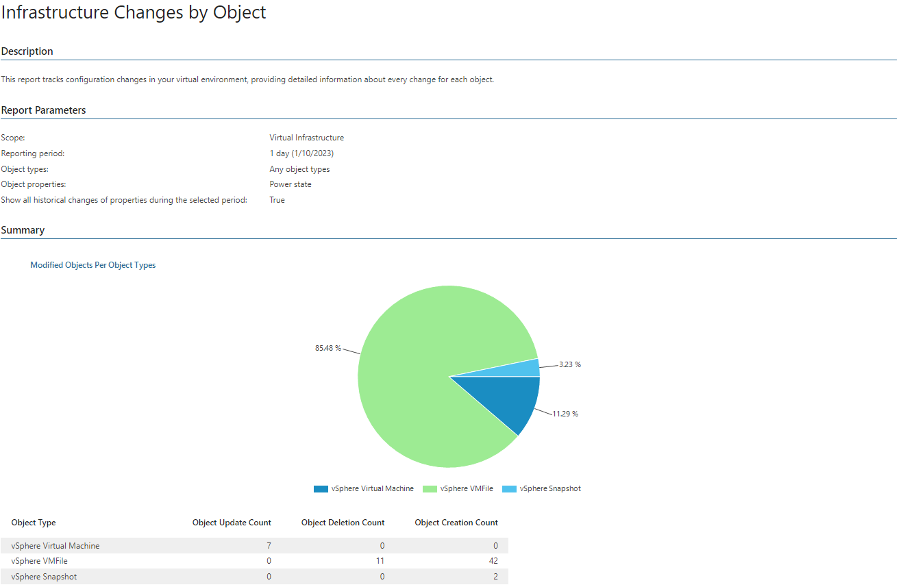
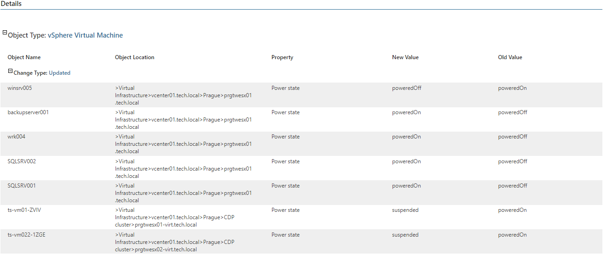

# Infrastructure Changes by Object

This report analyzes virtual infrastructure configuration changes and provides detailed information on changes performed for each object within the reporting period.

* The Summary section shows which object types were modified during the reporting period and provides information on update, deletion and creation counts for each object type.
* The Details table provides information on modified objects, including change type, object name, type and location, property changed and new and old values of the property.

Report Parameters

You can specify the following report parameters:

* Infrastructure objects: defines a virtual infrastructure level and its sub-components to analyze in the report.
* Business View objects: defines Business View groups to analyze in the report.

Business View groups from the same category are joined using Boolean OR operator, Business View groups from different categories are joined using Boolean AND operator. That is, if you select groups from the same category, the report will contain all objects that are included in groups. However, if you select groups from different categories, the report will contain only objects that are included in all selected groups.

* Period: defines the time period to analyze in the report. Note that the reporting period must include at least two successfully completed Object properties data collection tasks for the selected scope. Otherwise, the report will contain no data.
* Object types: defines a list of infrastructure objects to analyze in the report. To select multiple items, use the [Ctrl] or [Shift] key.
* Object properties: defines configuration properties for which the report will track changes. The list of available properties will depend on the selected object type. Use the Filter field to search for the necessary properties by name.
* Show all historical changes of properties during the selected period: defines whether to include in the report all historical changes for the specified time period.

Use Case

The report allows senior IT administrators to get details on recent infrastructure modifications made to target objects so that any unwanted action can be quickly rolled back.

Page updated 2026-07-31

