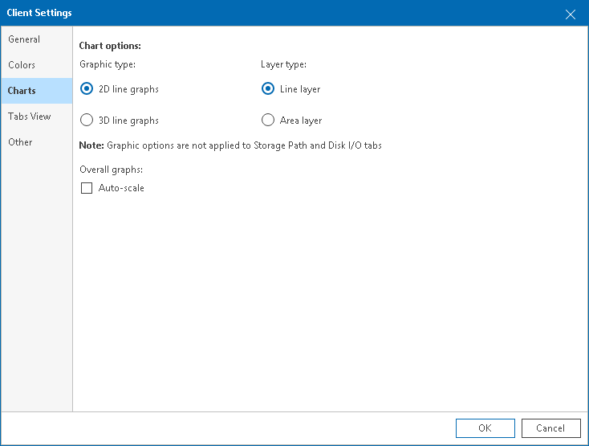
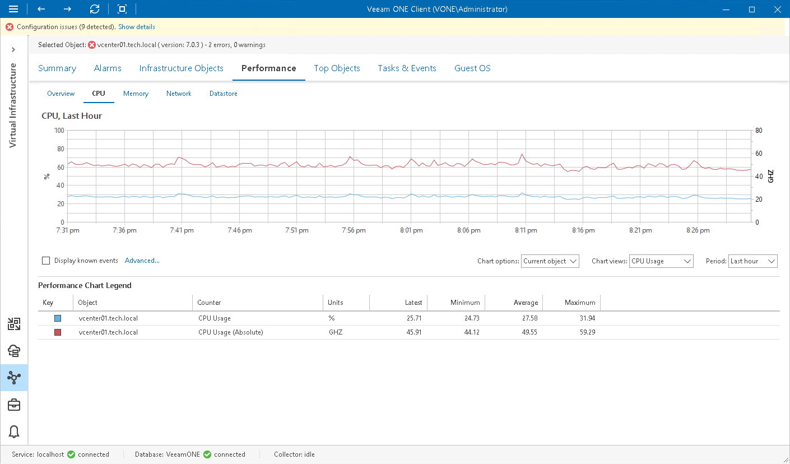
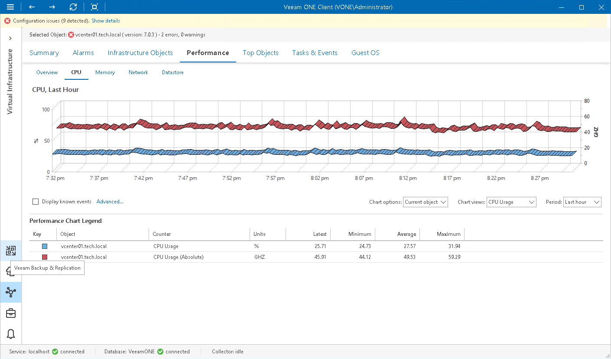
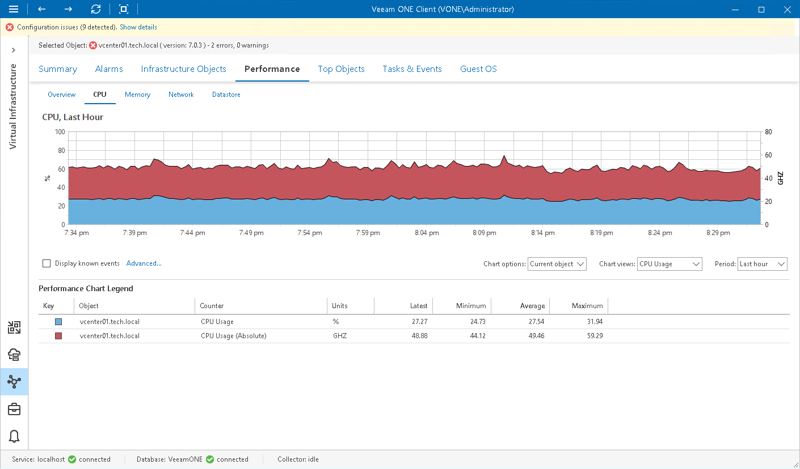
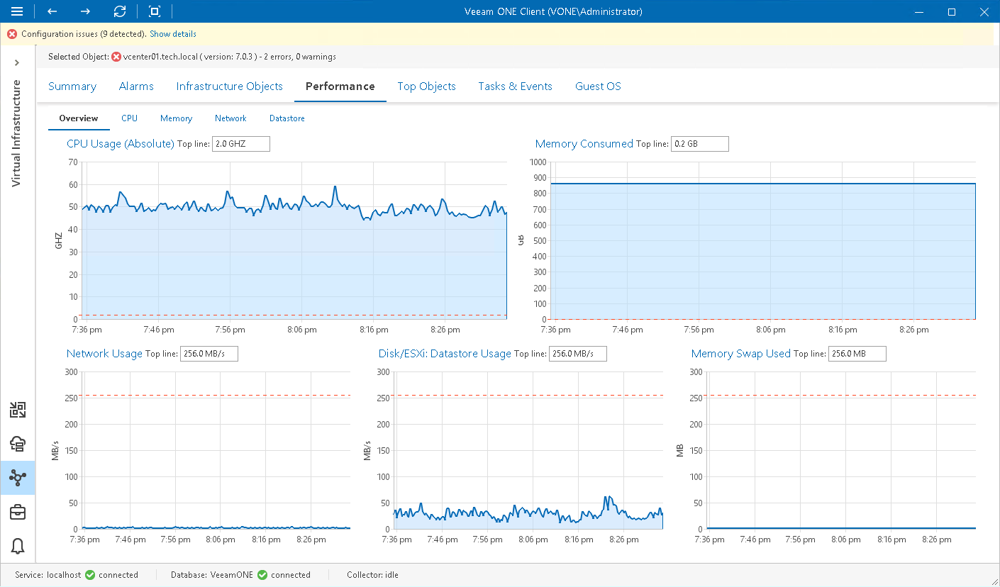
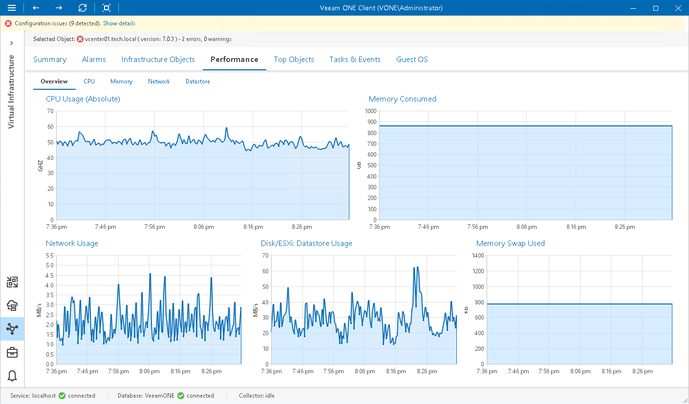

# Charts Settings

In charts settings, you can customize display preferences for graphs on performance charts.

To specify charts settings:

1. Open Veeam ONE Client.

For details, see [Accessing Veeam ONE Components](access.md).

1. In the main menu, click Settings > Client Settings.

Alternatively, press [CTRL + O] on the keyboard.

1. In the Client Settings window, open the Charts tab.
2. In the Chart options section, configure display preferences for graphs in performance charts:

* In the Graphic type section, choose how line graphs must be presented in charts — as 2D or 3D line graphs.
* In the Layer type section, choose how graphs layer must be presented in charts — as line layer or area layer.

For samples of graphic type and layer type combinations, see [Graphic and Layer Type Samples](chart_settings.md#graphs).

1. In the Overall graphs section, specify whether top line thresholds must be present on the Overview tab.

If the Auto-scale check box is enabled, the Y-axis will scale automatically to match the range of the displayed data.

For samples of the Overview tabs with the Auto-scale option enabled and disabled, see [Auto-Scale Samples](chart_settings.md#scale).

Graphic and Layer Type Samples

You can choose to show graphs in 2D or 3D, as plain lines or filled areas.

The following images illustrate how different combinations of line graphs and layer types will be reflected on performance charts:

* 2D line graphs with line layer

* 3D line graphs with line layer

* 2D line graphs with area layer

* 3D line graphs with area layer

Auto-Scale Samples

The Auto-scale option allows you to enable auto-scaling if you want to remove top line thresholds from performance charts on the Overview tab. With auto-scale enabled, the Y-axis scales automatically, to match the range of the displayed data.

* Auto-scale disabled

* Auto-scale enabled

