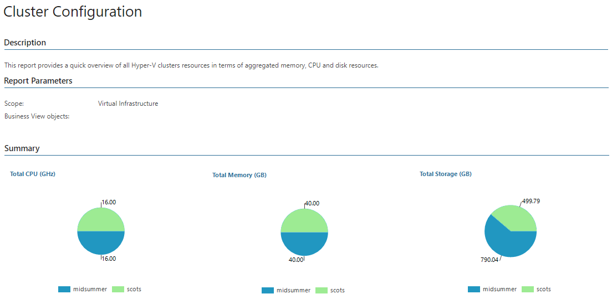

# Cluster Configuration (Hyper-V)

This report documents the current configuration of clusters in your infrastructure.

* The Total CPU (GHz), Total Memory (GB) and Total Storage (GB) charts show the amount of resources allocated to clusters.
* The Details table provides information on each cluster, including total number of hosts and VMs in the cluster, total amount of available cluster resources and the name of the cluster host owner.

Click a number in the Total Hosts column to drill down to host configuration details.

Click a number in the HA VMs column to drill down to VM configuration details.

* The Networking table provides information on network configuration for each cluster, including subnets, networks, cluster use and the number of VMs.

Report Parameters

You can specify the following report parameters:

* Infrastructure objects: defines a virtual infrastructure level and its sub-components to analyze in the report.
* Business View objects: defines Business View groups to analyze in the report. The parameter options are limited to objects of the Cluster type.

Business View groups from the same category are joined using Boolean OR operator, Business View groups from different categories are joined using Boolean AND operator. That is, if you select groups from the same category, the report will contain all objects that are included in groups. However, if you select groups from different categories, the report will contain only objects that are included in all selected groups.

Use Case

The report allows you to keep an eye on the state of hardware resources provisioned to your clusters, and to verify configuration settings applied to these clusters. This may help you balance workloads and right-size the environment to attain higher performance.

