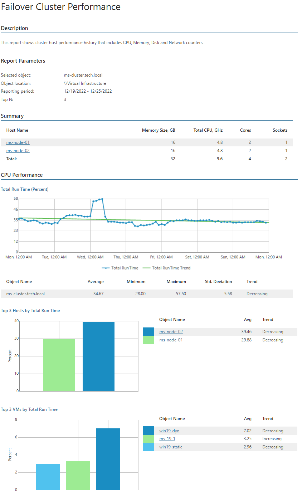

# Failover Cluster Performance

The report analyzes performance history of the failover cluster hosts and delivers statistics on CPU, memory disk and network usage over the specified reporting period.

* The Summary section describes configuration of each host in the cluster, including allocated memory and CPU resources and the number of CPU cores and sockets.
* The Performance subsections provide information on CPU, memory, disk and network usage, including usage trends and top resource consuming hosts and VMs in the cluster.

Click a host name in the summary table or in the list of top resource consuming hosts to drill down to performance charts with statistics on CPU, memory, disk and network usage for the host.

Click a VM name in the list of top resource consuming VMs to drill down to performance charts with statistics on CPU, memory, disk and network usage for the VM.

Report Parameters

You can specify the following report parameters:

* Object: defines a cluster to analyze in the report.
* Period: defines the time period to analyze in the report. Note that the reporting period must include at least one successfully completed Object properties data collection task for the selected cluster. Otherwise, the report will contain no data.
* Business hours from - to: defines time of a day for which historical performance data will be used to calculate the performance trend. All data beyond this interval will be excluded from the baseline used for data analysis.
* Top N: defines the maximum number of hosts and VMs to display in the report.

Use Case

The report shows resource consumption data for the selected cluster within a specified reporting period. You can use this data to detect clusters with performance issues, review resource provisioning, adjust workloads and optimize cluster overall performance.

Page updated 2026-07-17

