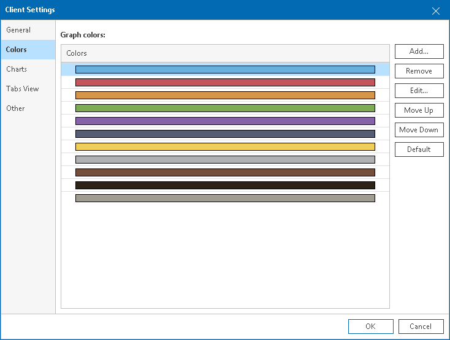

# Color Settings

In color settings, you can create a custom color scheme that will be used to display graphs on performance charts.

To specify color settings:

1. Open Veeam ONE Client.

For details, see [Accessing Veeam ONE Components](access.md).

1. In the main menu, click Settings > Client Settings.

Alternatively, press [CTRL + O] on the keyboard.

1. In the Client Settings window, open the Colors tab.
2. Create a custom color scheme that must be used to display graphs on performance charts.

You can add colors from the color palette, remove and edit existing colors, as well as sort them as required. Colors at the top are used first for graphs on performance charts.

