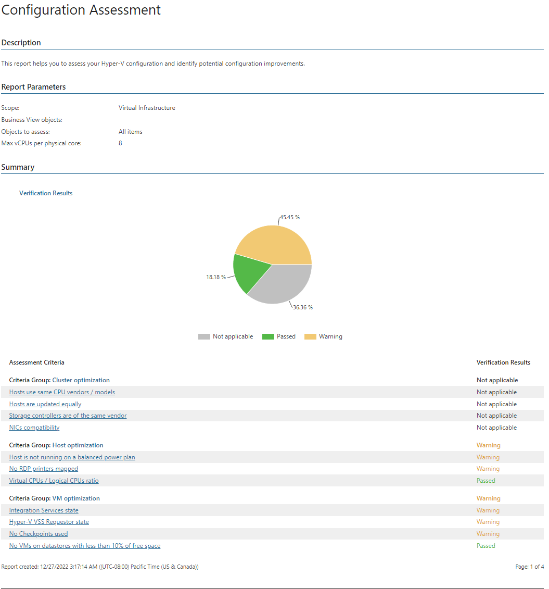
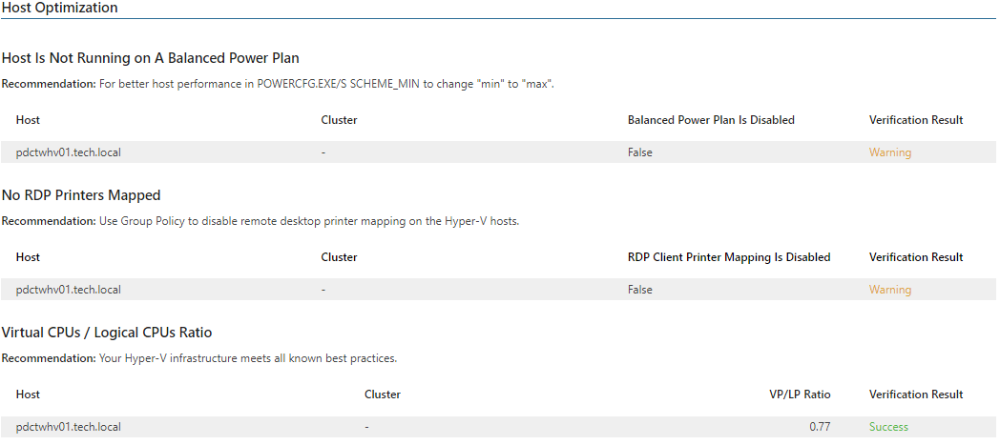

# Configuration Assessment

The report analyzes configuration of the Hyper-V infrastructure against a set of recommended settings and best practices, identifies clusters, hosts and\or VMs that are configured inefficiently and verifies problem areas to help mitigate issues and prepare VMs for backup with Veeam Backup & Replication.

* The Summary section includes the following elements:

* The Verification Results chart displays the share of failed and passed verification tests, and tests that completed with warnings.
* The Assessment Criteria table lists criteria used in the report to assess the Hyper-V infrastructure, and shows the assessment results.

* The Optimization tables show detailed assessment result for each criterion and provides recommendations on how to improve infrastructure configuration.

The report takes into account the following criteria when analyzing Hyper-V configuration:

Cluster Optimization

Cluster Optimization

| Criterion | Description |
| Hosts use same CPU vendors/models | The report analyzes cluster configuration to make sure clusters include hosts with CPUs of the same vendors.  A cluster that includes hosts with CPUs from different vendors may not operate correctly when you perform some tasks in Veeam Backup & Replication. For example, migration or restore of VMs to a host with a different processor may fail as some applications only run on processors of a specific vendor. |
| Hosts are updated equally | The report verifies that hosts in a cluster have the same Hyper-V version installed.  When hosts in a cluster have different Hyper-V versions installed, it may cause compatibility issues and unexpected errors. |
| Storage controllers are of the same vendors | The report analyzes cluster configuration to verify that storage controllers installed on hosts are of the same vendor.  If you have storage controllers of different vendors on hosts in a cluster, you may experience unexpected errors and failures. |
| NICs compatibility | The report analyzes cluster configuration to verify whether NIC cards within a cluster are of the same vendor.  Incompatible NIC cards may cause issues during backup and restore operations in a cluster. |

Host Optimization

Host Optimization

| Criterion | Description |
| Host is not running on a balanced power plan | The report analyzes host configuration to verify whether hosts in the infrastructure are running on a balanced power plan.  The Balanced power plan is the default power plan in Windows operating systems. However, to increase host efficiency, you are recommended using the High Performance power plan. |
| No RDP printers mapped | The report analyzes your infrastructure to verify that there are no RDP mapped printers on hosts.  Printers mapped through RDP may not work efficiently and may cause unexpected errors and failures. You can disable RDP printer mapping through a group policy. |
| Virtual CPUs/Logical CPUs ratio | The report analyzes the infrastructure to verify that maximum vCPU per host CPU core ratio is below the specified value. The default ratio is 8.  If CPU configuration is not balanced, VMs may not obtain enough processor resources. For information on how to measure processor performance, see this [Microsoft article](https://docs.microsoft.com/en-us/biztalk/technical-guides/checklist-measuring-performance-on-hyper-v). |

VM Optimization

VM Optimization

| Criterion | Description |
| Integration Services state | The report analyzes your infrastructure to verify that all Integration Services on VMs in the infrastructure are enabled.  Integration Services participate in application-aware image processing during backup in Veeam Backup & Replication. To use application-aware image processing efficiently, enable Integration Services. |
| Hyper-V VSS Requestor state | The report analyzes the infrastructure to identify the state of VSS Requestor on VMs.  If VSS Requestor is not started on a VM, this may cause issues during backup as VSS services will not be able to create a shadow copy and prepare data for backup.  If the state of VSS Requestor on a VM is Started/Automatic or Started/Automatic (Delayed Start), the report will show the Success verification result. In other cases, the verification result will be Warning. |
| No Checkpoints used | The report analyzes the virtual infrastructure to find VMs with existing checkpoints.  To use Veeam Changed Block Tracking for incremental backup, you must remove snapshots. |
| No VMs on datastores with less than 10% of free space | The report analyzes the Hyper-V infrastructure to find datastores that have less than 10% of free space.  During backup Veeam Backup & Replication triggers a checkpoint that is normally stored next to VM files on the source datastore. To eliminate the problem of datastores running low on free space during backup, it is required that the free space is more than 10%. |

Report Parameters

You can specify the following report parameters:

* Infrastructure objects: defines a virtual infrastructure level and its sub-components to analyze in the report.
* Business View objects: defines Business View groups to analyze in the report. The parameter options are limited to objects of the Cluster type.

Business View groups from the same category are joined using Boolean OR operator, Business View groups from different categories are joined using Boolean AND operator. That is, if you select groups from the same category, the report will contain all objects that are included in groups. However, if you select groups from different categories, the report will contain only objects that are included in all selected groups.

* Objects to assess: defines types of objects to analyze in the report.
* Max vCPUs per physical core: defines the threshold for the maximum number of vCPU cores per a single instance of the physical CPU core.

Use Case

This report shows a list of clusters, hosts and VMs in your virtual environment that could experience potential issues during backup, gets guidance on how to resolve these issues.

