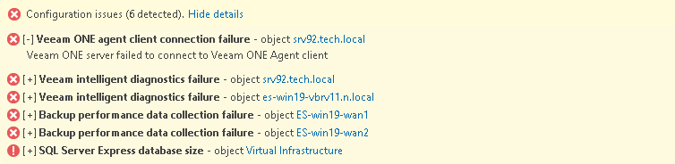

# Configuration Issues Pane

The Configuration issues pane displays information on alarms triggered as a result of internal Veeam ONE configuration issues (such as lost connection to a virtual server, data collection failure, license expiration and so on). To view details of internal alarms, click the Show details link on the pane. For details on working with internal configuration alarms, see [Working with Internal Alarms](internal_alarms.md).

