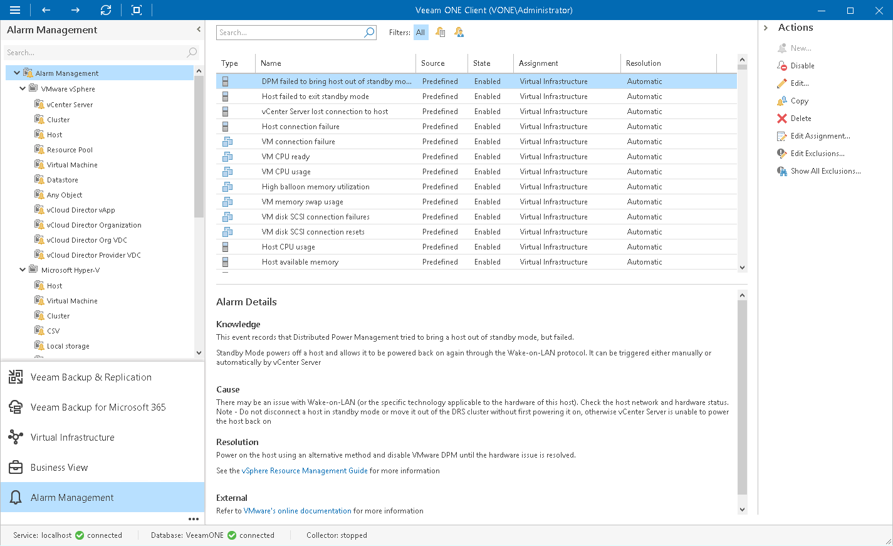

# Configuring Alarms

Veeam ONE comes with a set of predefined alarms that cover most common monitoring scenarios. You can customize predefined alarms or create new alarms to meet specific monitoring conditions.

To access the list of alarms:

1. Open Veeam ONE Client.

For details, see [Accessing Veeam ONE Components](access.md).

1. At the bottom of the inventory pane, click Alarm Management.
2. To limit the list of displayed alarms, you can use filter buttons — Show predefined alarms only, Show custom alarms only, All.

The Alarm Management view comprises the following panes — the inventory pane, information pane, and actions pane.

* The inventory pane on the left shows the alarm management tree with alarm object types: virtual infrastructure components to which alarms can be applied, VMware Cloud Director components, Veeam Backup & Replication and Veeam Backup for Microsoft 365 infrastructure components, and internal alarms.
* The information pane contains the list of predefined and custom alarms for the type of object that is selected in the alarm management tree. Every alarm is described with the following details: type, name, source (Predefined or Custom), state (Enabled or Disabled), assignment scope and resolve action (Automatic or Manual). The bottom section of the information pane displays information on the selected alarm, such as summary, cause, resolution and external resources.
* The Actions pane on the right displays a list of links that you can use to perform actions with alarms.

In This Section

* [Creating Alarms](create_alarms.md)
* [Modifying Alarms](modify_alarms.md)
* [Changing Alarm Assignment Scope](change_alarm_assignment.md)
* [Copying Alarms](copy_alarms.md)
* [Disabling and Enabling Alarms](disable_enable_alarms.md)
* [Deleting Alarms](delete_alarms.md)
* [Exporting and Importing Alarms](export_import_alarms.md)
* [Suppressing Alarms](suppress_alarms.md)
* [Modeling Alarm Number](model_alarms.md)
* [Configuring Alarm Notifications](configure_alarm_notification.md)

