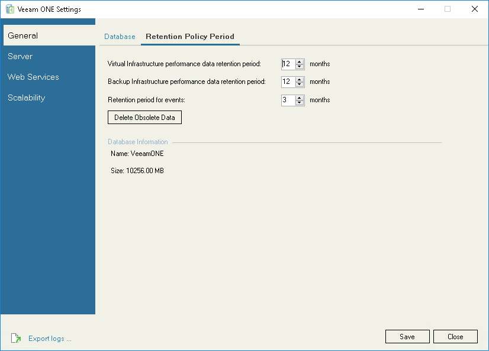

# Step 5. Configure Data Retention

In Veeam ONE Settings utility, review and change retention settings.

It is recommended to make the retention period for events 3 months or less, as events data take up a lot of space in the database. The retention period for virtual infrastructure and backup performance data is normally set to 6–12 months.

Decreasing the default retention values helps maintain a lower size of the Veeam ONE database, but results in reducing the period for which performance and events data is available in Veeam ONE Client and Veeam ONE Web Client.

1. In the menu on the left, click General.
2. Open the Retention Policy Period tab.
3. Specify for which period virtual infrastructure performance data, backup infrastructure performance data and events data must be stored.

Specified retention values will be applied at the end of the current week. To apply retention settings immediately, click Delete Obsolete Data.

1. Click Save.
2. In the displayed dialog box, click OK to restart Veeam ONE services.

