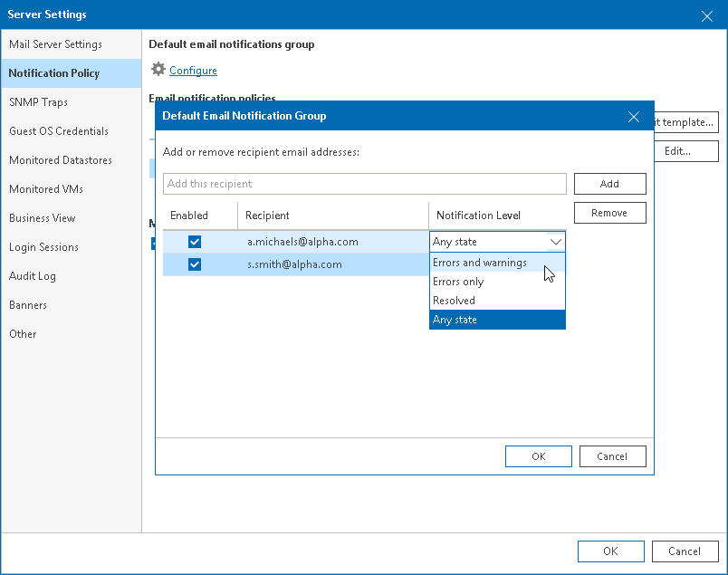
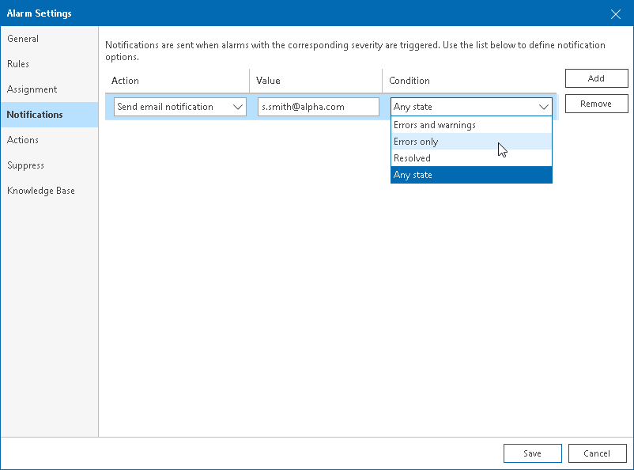

# Step 4. Configure Email Recipients

To report about triggered alarms by email, Veeam ONE must know where to deliver messages. When you configure alarm notifications, you must specify email addresses of users who will receive these notifications.

Veeam ONE offers the following options for configuring email notification recipients:

* [You can add recipients to the default email notification group](configure_email_recipients.md#default).

This option can be useful if you want to notify responsible personnel when alarms are triggered or when alarms change their statuses.

* [You can configure recipients for individual alarms](configure_email_recipients.md#alarms).

This option can be useful if you want to notify responsible personnel when a specific event occurs in the managed infrastructure.

Configuring Default Email Notification Group

The default email notification group includes a list of recipients who must be notified about alarms by email. All predefined alarms are configured to send email notifications to the default notification group. You can also configure custom alarms to send notifications to the default notification group.

To add recipients to the default email notification group:

1. Open Veeam ONE Client.

For details, see [Accessing Veeam ONE Components](access.md).

1. In the main menu, click Settings > Server Settings.

Alternatively, you can press [CTRL + S] on the keyboard.

1. Open the Notification Policy tab.
2. In the Default email notifications group section, click Configure.
3. In the Default Email Notification Group window, specify email addresses of notification recipients.

To add a recipient, in the Add this recipient field enter recipient email address and click Add. If you want to specify several recipients, separate email addresses with ";" (semicolon), "," (comma) or ", " (comma with space).

1. From the Notification Level list, choose the severity of alarms about which recipients must be notified:

+ Any state — an email notification will be sent every time when an alarm status changes to Error, Warning, Info or Resolved.
+ Errors and warnings — an email notification will be sent every time when an alarm status changes to Error or Warning.
+ Resolved — an email notification will be sent every time when an alarm status changes to Resolved.
+ Errors only — an email notification will be sent every time when an alarm status changes to Error.

1. Click OK.

You can temporarily disable email notifications for specific recipients in the default email notification group. The recipients will remain on the list, but they will no longer receive email notifications on triggered alarms.

1. In the Default Email Notification Group window, clear the check box next to recipient email address.
2. Click OK.

To permanently remove a recipient from the default email notification group:

1. In the Default Email Notification Group window, select an email address you want to delete and click Remove.
2. Click OK.

Configuring Recipients for Specific Alarms

You can add email notification recipients to each alarm individually and specify alarm severity about which the recipients must be notified.

To add one or more recipients to a specific alarm:

1. Open Veeam ONE Client.

For details, see [Accessing Veeam ONE Components](access.md).

1. At the bottom of the inventory pane, click Alarm Management.
2. To open the Alarm Settings window for the necessary alarm, do either of the following:

* Double click the alarm in the list.
* Right-click the alarm and choose Edit from the shortcut menu.
* Select the alarm in the list and click Edit in the Actions pane on the right.

1. In the Alarm Settings window, open the Notifications tab.
2. On the Notifications tab, click Add.
3. From the Action list, select the Send email notification option.
4. In the Value field, specify an email address of the recipient.

If you want to specify several recipients, separate email addresses with ";" (semicolon), "," (comma) or ", " (comma with space).

1. From the Condition list, choose the severity of alarms about which the recipient must be notified:

* Any state — an email notification will be sent every time when an alarm status changes to Error, Warning, Info or Resolved.
* Errors and warnings — an email notification will be sent every time when an alarm status changes to Error or Warning.
* Resolved — an email notification will be sent every time when an alarm status changes to Resolved.
* Errors only — an email notification will be sent every time when an alarm status changes to Error.

1. Click Save.

