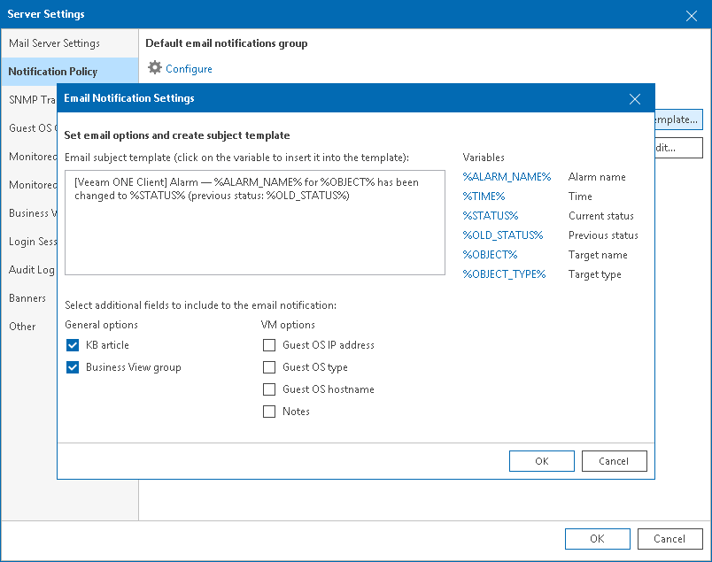
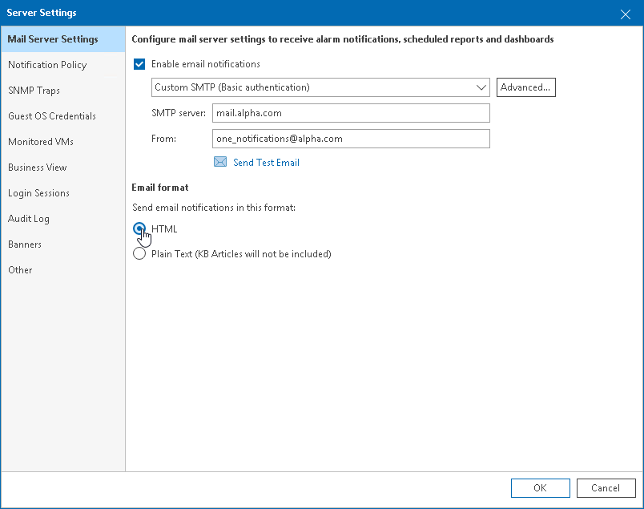

# Step 3. Customize Email Template

You can customize the email template used for alarm notifications. In the template, you can change the following items:

* [Email subject and body](configure_email_template.md#subject)
* [Email format](configure_email_template.md#format)

|  |
| --- |
|  Note: |
| You can customize the email template for Mission Critical notifications only. You cannot modify the template for alarm summary notifications sent in accordance with the Other notification policy. For more information on notification policies, see [Step 2. Configure Notification Frequency](configure_notification_frequency.md). |

Configuring Email Subject and Body

You can customize the email notification subject:

1. Open Veeam ONE Client.

For details, see [Accessing Veeam ONE Components](access.md).

1. In the main menu, click Settings > Server Settings.

Alternatively, you can press [CTRL + S] on the keyboard.

1. In the Server Settings window, open the Notification Policy tab.
2. In the Email notification policies section, select Mission Critical and click Edit template.
3. In the Email subject template field, specify the subject of the notification.

You can use the following variables in the subject text:

* %ALARM\_NAME% — name of the alarm
* %TIME% — date and time when the alarm was triggered or when the alarm status changed
* %STATUS% — current alarm status
* %OLD\_STATUS% — status of the alarm before its status was changed
* %OBJECT% — affected infrastructure object
* %OBJECT\_TYPE% — type of the affected infrastructure object
* %SOURCE% — affected child object
* %LOCATION% — location of the object in the infrastructure tree
* %HOST% — name of a vCenter Server, SCVMM server, or Veeam Backup & Replication server

1. In the Select additional fields to include to the email notifications section, select check boxes next to options you want to include in the body of the email message.

General options apply to email notification for all types of alarms.

* KB article — select this check box if an email notification must include a knowledge base article.
* Business View group — select this check box if an email notification must include a category assigned to the object in Business View.

VM options apply to email notifications for VM alarms.

* Guest OS IP address — select this check box if an email notification must include IP and MAC addresses of the affected VM.
* Guest OS type — select this check box if an email notification must include information about the guest OS of the affected VM.
* Guest OS hostname — select this check box if an email notification must include a DNS name of the affected VM.
* Notes — select this check box if an email notification must include custom notes that can be specified in alarm details.

1. Click OK.

Configuring Email Format

By default, Veeam ONE sends email notifications in the HTML format. You can change notification format to plain text. Note that plain text notifications do not support HTML elements, formatted text, colors or graphics. Plain text notifications also do not include knowledge base articles.

To choose the email notification format:

1. Open Veeam ONE Client.

For details, see [Accessing Veeam ONE Components](access.md).

1. In the main menu, click Settings > Server Settings.

Alternatively, you can press [CTRL + S] on the keyboard.

1. On the SMTP Settings tab, in the Email format section, choose a format: HTML or Plain Text.
2. Click OK.

