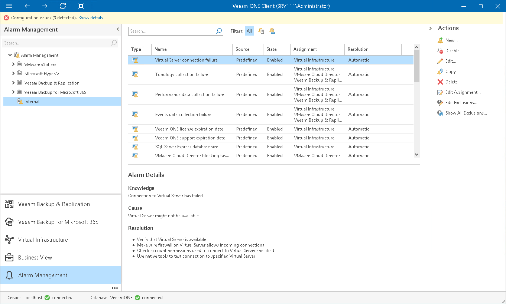

# Configuring Internal Alarms

You can configure internal alarms similarly to regular alarms:

1. Open Veeam ONE Client.

For details, see [Accessing Veeam ONE Components](access.md).

1. At the bottom of the inventory pane, click Alarm Management.
2. In the alarm management three, select the Internal node.
3. Select an alarm in the list and do either of the following:

* Double click the alarm.
* Right-click the alarm and choose Edit from the shortcut menu.
* In the Actions pane, click Edit.

1. Change the necessary alarm settings.

For details on working with alarm settings, see [Creating Alarms](create_alarms.md).

