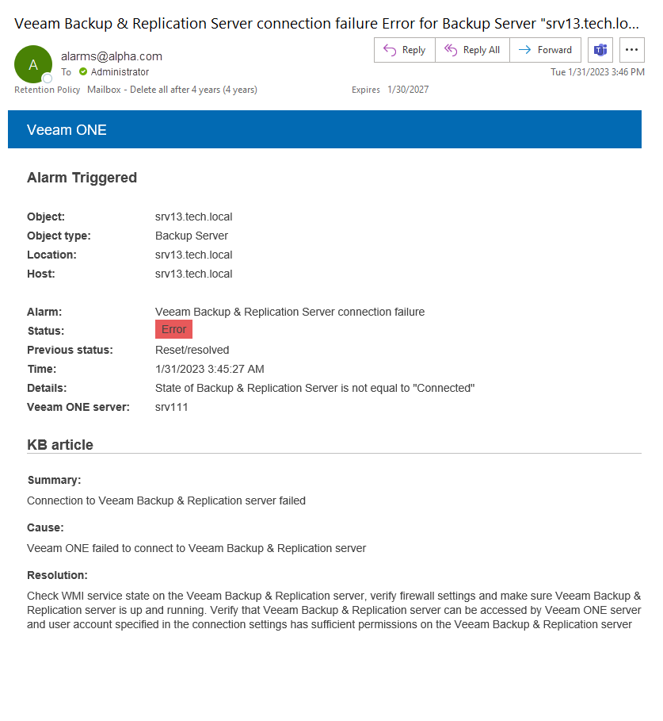
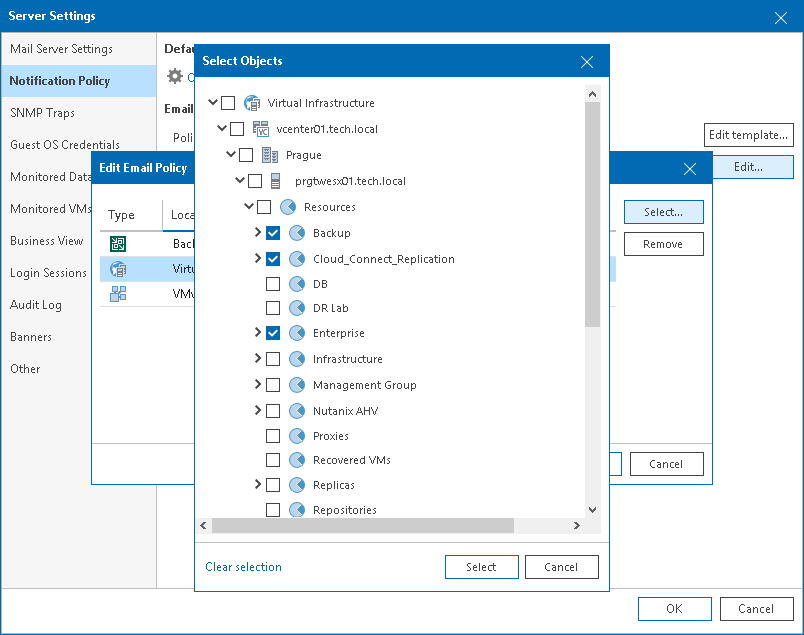
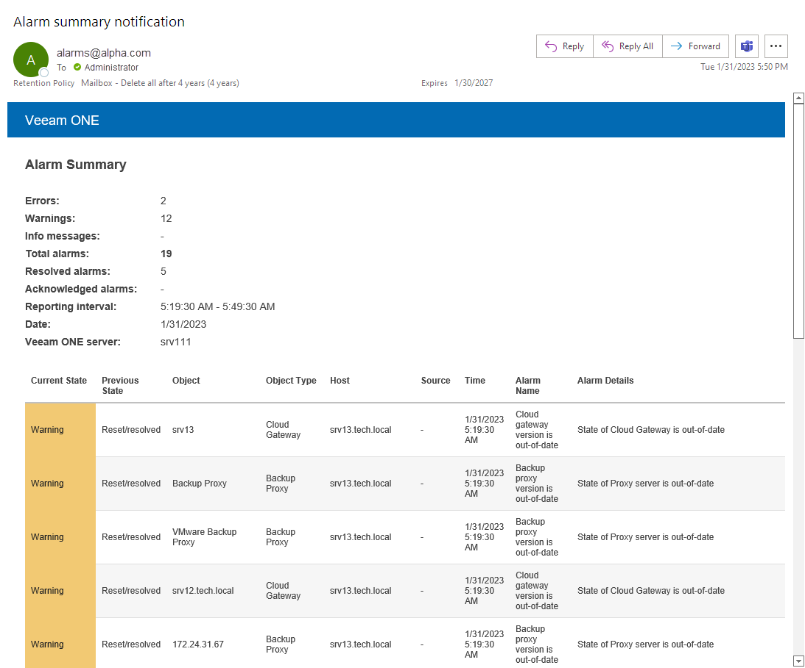
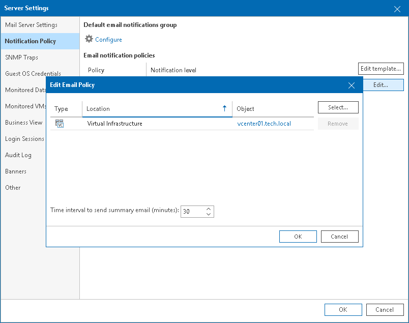

# Step 2. Configure Notification Frequency

Veeam ONE sends an email notification when a new alarm is created or when the status of an existing alarm is changed. If you do not want to receive an email message each time a new alarm is triggered or alarm status changes, you can change the notification frequency.

The frequency with which Veeam ONE sends email notifications is defined by notification policy. There are two types of notification policies:

* [Mission Critical](configure_notification_frequency.md#mission)
* [Other](configure_notification_frequency.md#other)

You can apply different types of notification policies to different infrastructure objects.

Enabling Mission Critical Notifications

Mission Critical notification policy is the default policy that is enabled for all infrastructure objects. This policy prescribes Veeam ONE to send an email notification every time a new alarm is created or the status of an existing alarm changes. An email notification contains details on the triggered alarm and affected object.

The following image shows an example of an email notification for the Mission Critical policy.

To apply the Mission Critical notification policy to an infrastructure object:

1. Open Veeam ONE Client.

For details, see [Accessing Veeam ONE Components](access.md).

1. In the main menu, click Settings > Server Settings.

Alternatively, you can press [CTRL + S] on the keyboard.

1. In the Server Settings window, open the Notification Policy tab.
2. In the Email notification policies section, select Mission Critical and click Edit.
3. In the Edit Email Policy window, click Select and choose one of the infrastructure types.
4. In the Select Objects window, click Select.
5. In the Edit Email Policy window, Click OK.

Enabling Summary Notifications

Other notification policy prescribes Veeam ONE to accumulate information about alarms and send an email notification once within a specific time interval (by default, a notification is sent once every 30 minutes). You do not receive a notification on every triggered alarm. Instead, Veeam ONE generates a message with a list of all alarms triggered over the past period.

You can choose how often you want to receive summary email notifications. For example, if you specify the time interval of 15 minutes, you will receive notifications with the list of alarms triggered over the past 15 minutes. If no alarms are triggered over the past 15 minutes, you will not receive a summary email notification.

The following image shows an example of a summary email notification for the Other policy.

By default, all infrastructure objects have the Mission Critical policy assigned. Before you apply the Other notification policy to an object, you must remove the default Mission Critical policy assignment:

1. Open Veeam ONE Client.

For details, see [Accessing Veeam ONE Components](access.md).

1. In the main menu, click Settings > Server Settings.

Alternatively, you can press [CTRL + S] on the keyboard.

1. In the Server Settings window, open the Notification Policy tab.
2. In the Email notification policies section, select the Mission Critical policy and click Edit.
3. In the Edit Email Policy window, select the necessary type of infrastructure objects and click Remove.
4. In the Edit Email Policy window, click OK.

To apply the Other notification policy to one or more infrastructure objects:

1. Open Veeam ONE Client.

For details, see [Accessing Veeam ONE Components](access.md).

1. In the main menu, click Settings > Server Settings.

Alternatively, you can press [CTRL + S] on the keyboard.

1. In the Server Settings window, open the Notification Policy tab.
2. In the Email notification policies section, select Other and click Edit.
3. In the Edit Email Policy window, click Select and choose one of the infrastructure types.
4. In the Select Objects window, click Select.
5. In the Time interval to send summary email (minutes) field, specify how often Veeam ONE must send out a summary email informing about triggered alarms. The default time interval is 30 minutes.
6. In the Edit Email Policy window, click OK.

