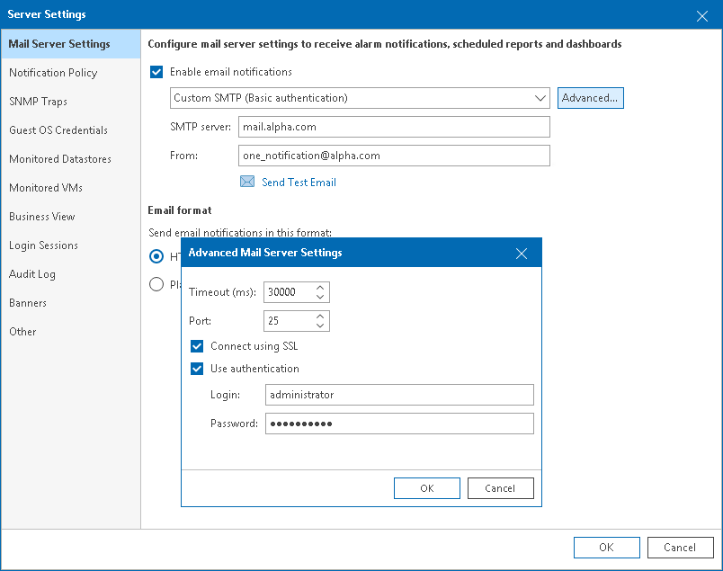
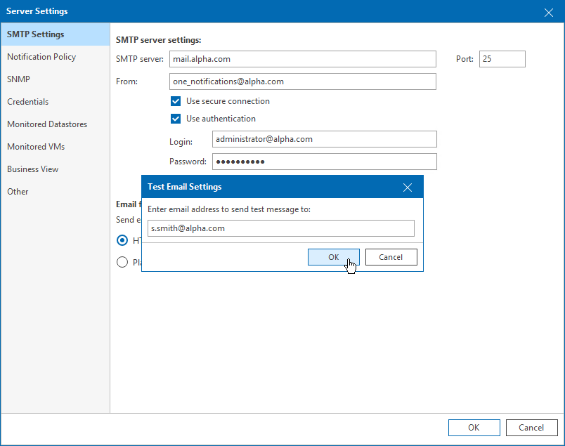

# Step 1. Configure SMTP Server Settings

To deliver email notifications, Veeam ONE needs an SMTP server.

To configure SMTP settings:

1. Open Veeam ONE Client.

For details, see [Accessing Veeam ONE Components](access.md).

1. In the main menu, click Settings > Server Settings.

Alternatively, you can press [CTRL + S] on the keyboard.

1. In the Server Settings window, open the Mail Server Settings tab.
2. Select the Enable email notifications check box.
3. From the drop-down list, select Custom SMTP (Basic authentication).
4. In the SMTP server field, specify DNS name or IP address of the SMTP server that must be used for sending email notifications.

The default SMTP port number is 25.

1. In the From field, enter an email address of the notification sender.

This email address will be displayed in the From field of the email header.

1. To configure additional settings, click Advanced:

1. In the Timeout field, specify server connection timeout in milliseconds.
2. In the Port field, change the default SMTP communication port if required.
3. For SMTP server with SSL support, select Connect using SSL to enable SSL data encryption.
4. If your SMTP server requires authentication, select the Use authentication check box and specify authentication credentials in the Login and Password fields.
5. Click OK.

Sending Test Email

To check whether you have specified SMTP settings correctly, you can send out a test email:

1. Click Send Test Email.
2. In the Test Email Settings window, specify an email address to which a test notification must be sent.
3. Click OK.

The test email will be sent to the specified email address. Veeam ONE will notify you whether the message was successfully sent.

