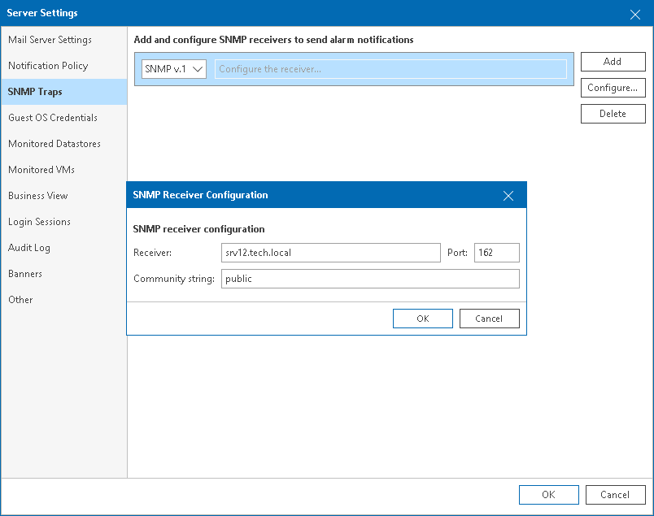
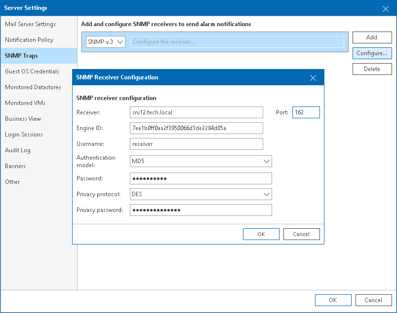

# Step 2. Configure SNMP Settings in Veeam ONE

To send SNMP traps, Veeam ONE must know trap destinations. You must specify a list of receivers to which Veeam ONE must send traps, and ports that SNMP receivers will listen.

To configure SNMP trap destination settings in Veeam ONE:

1. Open Veeam ONE Client.

For details, see [Accessing Veeam ONE Components](access.md).

1. In the main menu, click Settings > Server Settings.

Alternatively, you can press [CTRL + S] on the keyboard.

1. In the Server Settings window, open the SNMP Traps tab.
2. Click Add
3. From the drop-down list on the left, select the preferable SNMP version.
4. Configure receiver settings. To do that:

* For SNMP v.1 and v.2

1. Double-click the added entry in the list.

Alternatively, you can select the receiver entry and click Configure.

1. In the Receiver field, specify FQDN or IP address of the SNMP receiver.
2. In the Port field, specify the port number.
3. In the Community string field, specify the community identifier.
4. Click OK.
5. To add a new receiver to the list, click Add and repeat steps i-v.

* For SNMP v.3

1. Double-click the added entry in the list.

Alternatively, you can select the receiver entry and click Configure.

1. In the Receiver field, specify FQDN or IP address of the SNMP receiver.
2. In the Port field, specify the port number.
3. In the Engine ID field, specify an ID for an SNMP remote agent.
4. In the Username and Password fields, specify credentials for SNMP receiver user account.
5. From the Authentication model list, select the authentication algorithm for SNMP receiver user.
6. From the Privacy protocol list, select encryption method for SNMP messages.
7. In the Privacy password field, specify a password that an SNMP receiver will use for private access.
8. Click OK.
9. To add a new receiver to the list, click Add and repeat steps i-ix.

1. Click OK.

