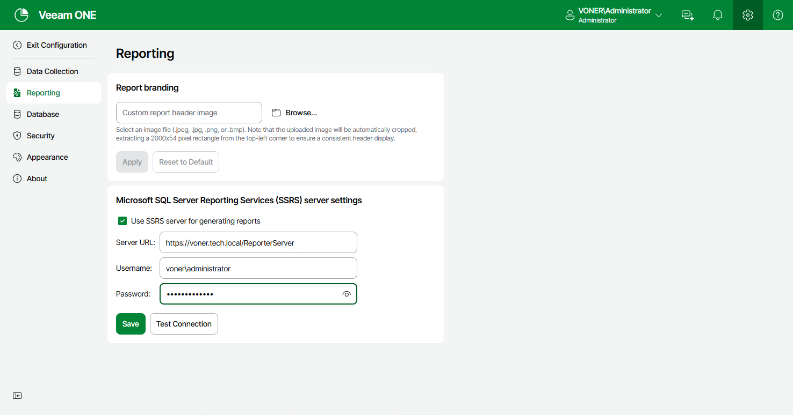

# Step 4. Configure Connection to SSRS Server

Configure a connection to Microsoft SSRS Server in Veeam ONE Web Client:

1. Log in to Veeam ONE Web Client as Veeam ONE Administrator.
2. Open Configuration.
3. In the configuration menu, click Reporting.
4. Select the Use SSRS server for generating reports check box.
5. In the Server URL field, type an URL to the Reporting Services report server page.

The URL must have the following form:

http://[ServerName]:port/ReportServer

If you configured a named instance for Microsoft SQL Server, the URL must look as follows:

http://[ServerName]:port/ReportServer\_NAMEDSQLINSTANCE

1. In the Username and Password fields, type credentials for connecting to the SSRS Server.

For details on permission requirements for SQL Server Reporting Services connection, see [Configuring SSRS Server Settings](configure_ssrs_server_settings.md).

1. Test connection to the SSRS Server and click Save.

