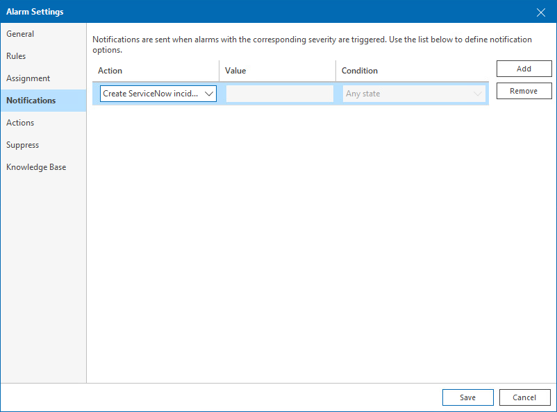

# Configuring ServiceNow Incidents

To receive ServiceNow incidents when an alarm is triggered, you must set ServiceNow notifications as a response action for every alarm manually.

To configure ServiceNow alarms:

1. Open Veeam ONE Client.

For details, see [Accessing Veeam ONE Components](access.md).

1. At the bottom of the inventory pane, click Alarm Management.
2. To open the Alarm Settings window for the necessary alarm, do either of the following:

* Double click the necessary alarm in the list.
* Right-click the alarm and choose Edit from the shortcut menu.
* Select the alarm in the list and click Edit in the Actions pane on the right.

1. In the Alarm Settings window, open the Notifications tab.
2. On the Notifications tab, click Add.
3. From the Action list, select Create ServiceNow incident.
4. Click Save.

