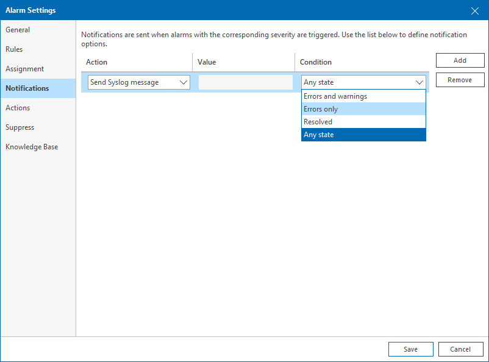

# Configuring Syslog Alarms

To receive Syslog alarms when an alarm is triggered, you must set Syslog notification as a response action for every alarm manually.

To configure Syslog alarms:

1. Open Veeam ONE Client.

For details, see [Accessing Veeam ONE Components](access.md).

1. At the bottom of the inventory pane, click Alarm Management.
2. To open the Alarm Settings window for the necessary alarm, do either of the following:

* Double click the necessary alarm in the list.
* Right-click the alarm and choose Edit from the shortcut menu.
* Select the alarm in the list and click Edit in the Actions pane on the right.

1. In the Alarm Settings window, open the Notifications tab.
2. On the Notifications tab, click Add.
3. From the Action list, select Send Syslog message.
4. From the Condition list, choose the severity of alarms to send Syslog messages:

+ Any state — a Syslog message will be sent every time when an alarm status changes to Error, Warning, Info or Resolved.
+ Errors and warnings — A Syslog message will be sent every time when an alarm status changes to Error or Warning.
+ Resolved — A Syslog message will be sent every time when an alarm status changes to Resolved.
+ Errors only — A Syslog message will be sent every time when an alarm status changes to Error.

1. Click Save.

