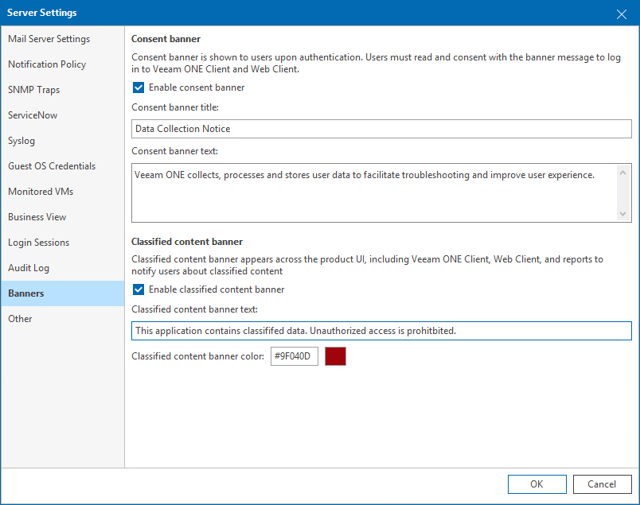

# Banners

On the Banners tab, you can configure consent and classified data banners to comply with data protection policies and regulations.

To configure banners:

1. Open Veeam ONE Client.

For details, see [Accessing Veeam ONE Components](access.md).

1. In the main menu, click Settings > Server Settings.

Alternatively, press [CTRL + S] on the keyboard.

1. In the Server Settings window, open the Banners tab.
2. Select Enable consent banner and specify banner title and text.

The banner will be shown to all users who log in to Veeam ONE Client and Veeam ONE Web Client. A user must click I Agree to continue working with Veeam ONE.

1. Select Enable classified content banner and specify text that will be shown to all users in Veeam ONE Client, Veeam ONE Web Client and generated reports.

In the Classified content banner color field, specify banner color in HEX format.

