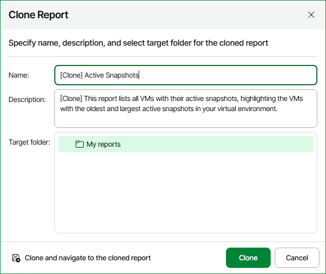

# Cloning Reports

You can create clones of reports that you have previously saved to My reports.

Cloning may save time if you need to create multiple instances of the same report. For example, you have configured a report with complex parameters and need create a set of similar reports with minor changes. In this situation, you can create several clones of the saved report and change report parameters for each report clone.

To create a report copy:

1. Open Veeam ONE Web Client.
2. Open the Saved Reports tab.
3. In the displayed list of reports, right click a saved report that you want to clone and select Clone in the context menu.
4. In the Clone Report window, specify the name of the report, its description and select a folder to which the report clone should be saved. You can only choose a folder in the My reports hierarchy.
5. Click Clone.

After you create a report clone, modify the report parameters as described in [Modifying Reports](modify_reports.md).

